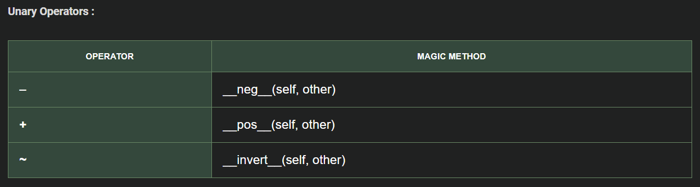

# 1. Python Summary

<!-- TOC -->
* [1. Python Summary](#1-python-summary)
* [2. Basic Concepts and Conventions](#2-basic-concepts-and-conventions)
  * [2.1. Comments and Docstrings (Documentation)](#21-comments-and-docstrings-documentation)
  * [2.2. Naming Conventions](#22-naming-conventions)
      * [2.2.1. Other considerations](#221-other-considerations)
  * [2.3. Input data](#23-input-data)
* [3. Variables](#3-variables)
  * [3.1. Numeric variables](#31-numeric-variables)
    * [3.1.1. Class `int`](#311-class-int)
      * [3.1.1.1. Numeric Bases](#3111-numeric-bases)
      * [3.1.1.2. Using the `int` Constructor](#3112-using-the-int-constructor)
      * [3.1.1.3. Random `int` number](#3113-random-int-number)
    * [3.1.2. Class `float`](#312-class-float)
      * [3.1.2.1. Float Formatting with `.xf`](#3121-float-formatting-with-xf)
      * [3.1.2.2. Exponential Notation](#3122-exponential-notation)
      * [3.1.2.3. Infinity values](#3123-infinity-values)
      * [3.1.2.4. NaN(Not a Number)](#3124-nannot-a-number)
  * [3.2. Class str ( Strings)](#32-class-str--strings)
    * [3.2.1. String Operations](#321-string-operations)
    * [3.2.2. String format](#322-string-format)
    * [Special Characters](#special-characters)
    * [String Methods (do not replace the original string!)](#string-methods-do-not-replace-the-original-string)
      * [Case and Space Management](#case-and-space-management)
      * [Substring Handling](#substring-handling)
      * [String Modification and Repetition](#string-modification-and-repetition)
    * [Codificación de caracteres](#codificación-de-caracteres)
      * [Unicode](#unicode)
      * [UTF-8](#utf-8)
      * [ASCII](#ascii)
    * [Print Statement](#print-statement)
  * [Data type conversion](#data-type-conversion)
* [Operators](#operators)
  * [Arithmetic operators](#arithmetic-operators)
  * [Assignment](#assignment)
    * [Value exchange without temporary variable](#value-exchange-without-temporary-variable)
    * [Compound assignments](#compound-assignments)
  * [3.3. Conditional and logical operators](#33-conditional-and-logical-operators)
  * [3.4. Operator Precedence in Python](#34-operator-precedence-in-python)
* [4. Sentences](#4-sentences)
  * [4.1. Control Sentences](#41-control-sentences)
  * [Loop sentences](#loop-sentences)
* [Collections](#collections)
  * [List `my_list = [item_1, item_2, item3]`](#list-my_list--item_1-item_2-item3)
    * [Operations with lists](#operations-with-lists)
  * [4.2. Tuple `my_tuple = (item_1, item_2, item_3)`](#42-tuple-my_tuple--item_1-item_2-item_3)
    * [4.2.1. Operations with tuples](#421-operations-with-tuples)
  * [Set `my_set = {item_1, item_2, item_3}`](#set-my_set--item_1-item_2-item_3)
    * [Operations with sets](#operations-with-sets)
  * [4.3. Dictionary `my_dictionary = {key_1: value_1, key_2: value_2}`](#43-dictionary-my_dictionary--key_1-value_1-key_2-value_2)
    * [4.3.1. Operations with dictionaries](#431-operations-with-dictionaries)
  * [List comprehension `[operation for element in iterable if condition]`](#list-comprehension-operation-for-element-in-iterable-if-condition)
* [Modules](#modules)
  * [Modules characteristics](#modules-characteristics)
* [Functions](#functions)
  * [Arguments](#arguments)
  * [Use of a global variable inside a function](#use-of-a-global-variable-inside-a-function)
  * [Recursive functions](#recursive-functions)
* [Class and Objects](#class-and-objects)
  * [Dynamic Context](#dynamic-context)
    * [Constructor and Object Methods](#constructor-and-object-methods)
    * [Attribute and Method Encapsulation](#attribute-and-method-encapsulation)
      * [Improved Encapsulation (More Pythonic with Decorators)](#improved-encapsulation-more-pythonic-with-decorators)
    * [Adding a New Attribute to a Specific Object (Dynamic Attributes)](#adding-a-new-attribute-to-a-specific-object-dynamic-attributes)
  * [Static Context](#static-context)
    * [Class Attributes and Methods](#class-attributes-and-methods)
* [Inheritance and Polymorphism](#inheritance-and-polymorphism)
  * [Polymorphic Function](#polymorphic-function)
  * [Object Class](#object-class)
  * [Multiple Inheritance](#multiple-inheritance)
  * [Abstract Class](#abstract-class)
  * [Operator Overloading](#operator-overloading)
* [Exceptions](#exceptions)
* [File Handling](#file-handling)
  * [Context Manager 'with'](#context-manager-with)
* [Logging in Python](#logging-in-python)
* [.env file](#env-file)
* [Databases](#databases)
  * [Basic SQL Queries](#basic-sql-queries)
* [PostgreSQL in python](#postgresql-in-python)
  * [pgAdmin4 (graphical interface for PostgreSQL)](#pgadmin4-graphical-interface-for-postgresql)
  * [Creating connection and executing statements](#creating-connection-and-executing-statements)
  * [Transaction management (commit/rollback)](#transaction-management-commitrollback)
* [MySQL](#mysql)
  * [Pool](#pool)
<!-- TOC -->
# 2. Basic Concepts and Conventions

## 2.1. Comments and Docstrings (Documentation)

- Use `# [TEXT]` to write single-line comments that explain the code.
- Use `''' [TEXT] '''` to write multi-line comments.  
> ### Docstrings
> 
> Multi-line comments are also used to create ***docstrings*** for `classes, methods, and modules`. These are added immediately after their definition or at the beginning of the module to provide clear documentation.  
>- `name.__doc__`: Returns the *docstring* of a class, method, or module, but **does not** include the documentation for its components.  
>- `help(name)`: Displays the complete documentation for a class, method, or module, including all the associated *docstring*.*
> 
>*When called from an instance, it provides the *docstring* associated with the class of the object.*

``` python
def MyMethod(param1, param2):
    '''
    MyMethod Docstrings documentation
    :param param1 This is de param1:
    :param param2 This is the param2:
    :return result This is the result:
    '''
    result= param1  + param2 
    return result
```

## 2.2. Naming Conventions

- *Avoid having files and directories with the same name to prevent errors in Python.*
- **Constants**: By convention, constants are named in uppercase (e.g., `CONSTANT_VALUE`) and should remain unmodified during the program's execution.
- **File names**, **functions** and **common variables**:

  > ### Snake Case 
  > Snake Case format is used for **file names**, **functions** and **common variables**: `[a-z][a-z0-9_]+`.
  >   >- **Use underscores** (`_`) to separate words in multi-word names (e.g., `file_txt`).  
  >   >  - **Add prefixes or suffixes** to provide context (e.g., `is_valid`, `user_count`)
- **Classes**
  > ### PascalCase  
  >  PascalCase (also known as UpperCamelCase) is conventionally used only for naming **classes** in Python.  
  > > - The name begins with an uppercase letter.  
  > >   - Each subsequent word also starts with an uppercase letter, without spaces or underscores (e.g., `MyClass`, `UserProfile`).  

#### 2.2.1. Other considerations

- Be descriptive but concise: the name should clearly indicate the purpose or role of the variable or object.
- Avoid
  - Python's reserved keywords.  
  - Single-letter variable names (except for specific cases like indices).  
- **Use plural names exclusively** for collections (e.g., `items_list`).
- **Protected and Private Attributes**:
  - Protected attributes are used in classes to give more control over reading and writing attributes. By convention, these are prefixed with `_`.
  - Private attributes are prefixed with `__` to prevent unintended overwriting or access, though Python does not strictly enforce this protection.
- **Readable and Descriptive Names**:
  - Always aim for clear and descriptive names to improve code readability.
  - Avoid abbreviations unless they are widely recognized within your project or field (e.g., `img` for image).

## 2.3. Input data

- **User data**: `input("Message")` prompts the user for input and always returns a string. Type conversion is necessary afterward if a different data type is needed.


# 3. Variables
- **Dynamic typing**: Variables can store any type of data and change its type without explicit casting.
- **Objects**: Variables in Python are objects (from class of their type): references stored in the *stack* and point to data in the *heap*.
  - `id(my_var)`: position of memory of the variable object.
  - `type(my_var)`: class of the object stored in my_var (variable type of my_var)
  -  With variable and dot: `x.` (*possible type operations of its class*)
- **Mutability**: If the value of a variable changes, a new object is created with the updated data, and the variable points to this new reference.
- **Initialization**: Variables must be declared with an initial value. 


## 3.1. Numeric variables

### 3.1.1. Class `int`

#### 3.1.1.1. Numeric Bases
- **Decimal (base 10 - default)**: Any number without a prefix, like `123`.
- **Binary (base 2)**: Prefixed with `0b` or `0B`. Example: `0b101` equals 5 in decimal.
- **Octal (base 8)**: Prefixed with `0o` or `0O`. Example: `0o7` equals 7 in decimal.
- **Hexadecimal (base 16)**: Prefixed with `0x` or `0X`. Example: `0xA` equals 10 in decimal, and `0x1F` equals 31 in decimal.

#### 3.1.1.2. Using the `int` Constructor
- Create integers from strings in any base using `int(string, base)`. Examples:
  ```python
  num = int("101", 2)  # Binary to decimal, result is 5
  num = int("17", 8)   # Octal to decimal, result is 15
  num = int("A", 16)   # Hexadecimal to decimal, result is 10

#### 3.1.1.3. Random `int` number
- Use the `randint(a, b)` function from the `random` module to generate a random integer between `a` and `b` (inclusive). Example:
  ```python
  import random
  random_num = random.randint(1, 10)  # Generates a number between 1 and 10
  ```


### 3.1.2. Class `float`

#### 3.1.2.1. Float Formatting with `.xf`

The `.xf` notation is used to format floats by specifying the number of decimal places in the output. Here's how it works:
- `{value:.xf}`
  - `value`: The float to format.
  - `x`: The number of decimal places.

```python
# Define the number
value = 12.34567

# Different string representations with expected results
original = f"Original: {value}" # 'Original: 12.34567'
f_string = f"Using f-strings with 3 decimal places: {value:.3f}"  # 'Using f-strings with 3 decimal places: 12.346'
no_decimals = f"Without decimal places: {value:.0f}"  # 'Without decimal places: 12'
left_align = f"Left alignment with 2 decimals: {value:<10.2f}"  # 'Left alignment with 2 decimals: 12.35     '
right_align = f"Right alignment with 2 decimals: {value:>10.2f}"  # 'Right alignment with 2 decimals:      12.35'
padded = f"Zero-padded (total 7 characters): {value:07.2f}"  # 'Zero-padded (total 7 characters): 0012.35'
```


#### 3.1.2.2. Exponential Notation
- Floats can be represented in exponential (scientific) notation
  ``` python
  my_var = 3e5  # Equivalent to 300000.0
  my_var = 0.00003  # Can also represent very small values
  ```


#### 3.1.2.3. Infinity values
  - Python supports positive and negative infinity
  ``` python
  import math
  from decimal import Decimal
  
  # Positive infinity
  positive_infinity = float('inf')  # Using float
  positive_infinity = math.inf      # Using math
  positive_infinity = Decimal('Infinity')  # Using Decimal
  
  # Negative infinity
  negative_infinity = float('-inf')  # Using float
  negative_infinity = -math.inf      # Using math
  negative_infinity = -Decimal('Infinity')  # Using Decimal
  
  # Check if a value is infinite
  is_infinite = math.isinf(value)  # Returns True if the value is infinite
  ```

#### 3.1.2.4. NaN(Not a Number)
  - Represents undefined or unrepresentable numeric data
  ``` python
  from decimal import Decimal
  import math
  
  # Define NaN
  my_var = float("NaN")  # Using float
  my_var = Decimal("NaN")  # Using Decimal
  
  # Check if a value is NaN
  is_nan = math.isnan(my_var)  # Returns True if the value is NaN
  ```


## 3.2. Class str ( Strings)
- **Defining Strings**: Strings can be defined using `'`, `"`, or `'''`. Triple quotes allow line breaks to be included directly within the text.

- **Character Indexing**:
  - Characters are indexed from `0` to `length-1`.
  - Negative indexing allows access to characters from the end of the string: `string[-1]` retrieves the last character.

- **Immutability**: Strings cannot be modified after they are created.

### 3.2.1. String Operations
**Concatenation**:   Use `+` or `+=`: `string_1 + string_2` or `string_1 += string_2`
- *For literals string only: an space `lit_string_1 lit_string_2`*

**Joining**: Combine list elements using a separator:
- Using `split_string.join([list of strings])`
  - e.i. if `' '.join(stringX)` is used, it adds space bettween characters.

**Splitting**: Divide a string into parts:
- To split a string into a list, use `text.split(separator)`. By default, the separator is a space.

### 3.2.2. String format
**f-string** (recommended): `f' Hola {variable}'`
	* *Can evaluate expressions inside the string. `f"{num1 + num2}"`*

** `%` formatting **
  - Insert values using placeholders (%s, %d, %.xf)
    - "%s %d %.2f"%(string_var, int_var, float_var)

**`format()` method (more complex and less commonly used)**: `'Hello {}'.format(variable)`
  - You can specify the order of variables using indices `{0} {2} {1}`; otherwise, they are inserted in order.
    - It is also possible to specify formats, for example: `{0:.2f}`.
  - You can indicate variable names, e.g., `{name}` and use `.format(name=variable)`.
    - With dictionaries, you can also use `{dict[key]}`: `.format(dict=dictionary)`.

**Other formats**: `string.center(num, character)` can center the content of a string, padded with the specified `character` to make the total length `num` (useful for printing titles).
  ```python
  title = "Hello"
  centered_title = title.center(10, "-")
  print(centered_title)  # Output: "---Hello---"
```

### Special Characters
- The backslash (`\`) is used to include special characters:
  - `\n`: New line.
  - `\t`: Tab.
  - `\b`: Back space (delete last character)
    - `\b\b`: Back spaces (delete last [\b items] characters)
  - `\\`: Backslash (`\`).
  - `\'`: Single quote within single-quoted strings.

- User of raw string: `r'String with special caracteres showed literaly'`


### String Methods (do not replace the original string!)
#### Case and Space Management
- **Change Case**: `str1.upper()`, `str1.lower()`, `str1.title()`, `str1.capitalize()`.
- **Check Case**: `str1.islower()`, `str1.isupper()`.
- **Trim Spaces**: `str1.strip()`.
- **Measure Length**: `len(str1)`.

#### Substring Handling
- **Extract Substring**: `str1[start:end]` (end index is excluded).
- **Find Substring**: `str1.find(substring)` (returns -1 if not found).
- **Count Substring**: `str1.count(substring)`.
- **Check Membership**: `"substring" in str1`.
- **Starts or Ends With**: `str1.startswith(prefix)`, `str1.endswith(suffix)`.

#### String Modification and Repetition
- **Replace Substring**: `str1.replace(old_substr, new_substr)`.
- **Split and Join**:
  - `str1.split(sep)` Splits into a list using a separator (default is space).
  - `"separator".join(list)` Joins list elements into a single string.
- **Repeat String**: `str1 * n` Repeats the string `n` times.
- **Format Strings**: `str1.center(width, character)` → Centers the string within a specified width, padded with `character`.


### Codificación de caracteres

#### Unicode
  A universal standard assigning unique hexadecimal codes to all characters, including icons and symbols.  
  - Example: `A` is `U+0041`, and `ñ` is `U+00F1`.  

- **Usage in Python 2**:  
  - Python 2 does not use Unicode by default; strings are **ASCII**.  
  - To work with Unicode, use `u"..."` to define Unicode strings.  

- **Usage in Python 3**:  
  - Strings (`str`) are Unicode by default, requiring no additional declarations.  


#### UTF-8

  A widely-used encoding that represents Unicode characters using 1 to 4 bytes.  
  - Example: `A` is encoded as `\x41` (1 byte), and `ñ` as `\xc3\xb1` (2 bytes).

- **Usage in Python 2**:  
  - You must explicitly set UTF-8 encoding at the beginning of the file using `# -*- coding: utf-8 -*-`.  
  - Unicode strings can be encoded to UTF-8 with `.encode("utf-8")`.  

- **Usage in Python 3**:  
  - **UTF-8** is the default encoding for reading, writing files, and external data operations.  

    ``` python
    bstring = b"..." # Only ASCII literal characters
    print(bstring[0]) # Print ASCII code from the character in position 0
    ```
  - Unicode strings are encoded to UTF-8 using `.encode("utf-8")`.  
    ``` python
    unicode_string = "Mañana 😀" # Unicode string
    print(unicode_string)
    utf8_string =unicode_string.encode('UTF-8') # Encode to utf8
    print(utf8_string)  # > b'Ma\xc3\xb1ana \xef\xb7\xbc'
    decode_utf8_string =utf8_string.decode('UTF-8') # Decode from utf8
    print(decode_utf8_string) # > "Mañana 😀"
    ```

#### ASCII
  A basic encoding representing 128 characters using 1 byte (7 bits). It includes English letters, digits, and common symbols.  
  - Example: `A` is encoded as `65` in decimal or `\x41` in hexadecimal. It does not support special characters like `ñ`.  

- **Usage in Python 2**:  
  - Strings are encoded in **ASCII** by default, limited to 128 characters.  
  - Attempting to use non-ASCII characters without proper setup causes errors. *`# -*- coding: utf-8 -*-` to chagne to UTF-8.*

- **Usage in Python 3**:  
  - ASCII is compatible as a subset of Unicode, and basic characters are handled similarly.  

- Encode Unicode (or UTF-8) to ASCII with error handling:
  ``` python
  unicode_string = "Mañana 😀" # Unicode string
  
  # Attempt to encode as ASCII with error handling
  ascii_string = unicode_string.encode("ascii", "ignore").decode("ascii")
  print(ascii_string.decode("ascii"))  # Output: "Maana "(ñ and icon are removed)
  
  # Alternatively, replace unsupported characters
  ascii_string_replace = unicode_string.encode("ascii", "replace")
  print(ascii_string_replace.decode("ascii"))  # Output: "Ma?ana ?" (? replaces ñ and icon)
  ```


### Print Statement
  - Basic example: `print(x, "y", z)`.
  - Using commas automatically adds spaces between the values in the output.
  - To print a blank line: `print()`.
  - To change final character (default break line) and/or separation character(s) `print(var1, end=' ', sep=', ')`


## Data type conversion

- `int(x)` *if x is bool: 0 (False), 1 (True)*
- `float(x)` *Converts x to a floating-point number.*  
- `str(x)` *if x is bool: "False" (False), "True" (True)*
- `bool(x)` *`False` value if x is 0, None, or an empty string (" ") or empty collection ( [], (), {} ).*
- Other conversions `hex(x)` *hexadecimal*


# Operators

## Arithmetic operators

- `+ - *` `/` *float division* `//` *integer division* `%` *modulo* `**` *power*
*If one of the operators is float result are always float. 
## Assignment

- `var_x = value` *Assigns a value to a variable.*
- Multiple assignment: `var_x, var_y, var_z = value_x, value_y, value_z` *Assigns values to multiple variables in a single line.*
- Chained assignment: `var1 = var2 = … = value` *Assigns the same value to multiple variables.*

### Value exchange without temporary variable
- `x, y = y, x` *Swaps the values of `x` and `y` without using a temporary variable.*

### Compound assignments
- `variable OPERATOR = value` *Equivalent to `variable = variable OPERATOR value` (e.g., `x += 5` is equivalent to `x = x + 5`).*

---

## 3.3. Conditional and logical operators

- **Return a boolean result**
- **Conditional**: `< > <= >= == !=`
  - *Can use multiple operands: `value_min <= value_x <= value_max`.*
  - *For strings, compares based on ASCII values.*

- **Logical**: `and` `or` `not`
  - *Use `not` to check if a variable is empty. For example: `if not var_x`, returns `True` if `var_x` is empty.*

## 3.4. Operator Precedence in Python
Python follows a specific order of precedence for operators:

1. **Parentheses**
   - `()` have the highest precedence and are used to force the evaluation order.

2. **Exponentiation**
   - `**`

3. **Unary Operators**
   - Unary Plus and Minus: `+`, `-`

4. **Arithmetic Operators**
   - 4.1. Multiplication, Division, Floor Division, Modulus: `*`, `/`, `//`, `%`
   - 4.2. Addition and Subtraction: `+`, `-`

5. **Comparisons**
   - Equality and Relational: `==`, `!=`, `>`, `<`, `>=`, `<=`

6. **Logical Operators**
   - `and`, `or`, `not`
7. **Assignment and Compound Assignments**
   - `=`, `+=`, `-=`, `*=`, `/=`, `%=`, `**=`, `//=`
---

---

# 4. Sentences

Note: It is not nesseray to convert a varaible to a bool to use the sentencies (conversions are automatic)
## 4.1. Control Sentences

- `if`, `elif`, `else`
- Ternary operator: `result = true_value if condition else false_value`
  - *Use only if the statement fits on one line.*

In Python, a `switch` statement does not exist.

- Use of dictionary

``` python
def opcion_1():
    print("Ejecutando la opción 1...")
    return "Opción 1 completada"

def opcion_2():
    print("Ejecutando la opción 2...")
    return "Opción 2 completada"

def opcion_3():
    print("Ejecutando la opción 3...")
    return "Opción 3 completada"

def switch_demo(argument):
    opciones = {
        1: opcion_1,
        2: opcion_2,
        3: opcion_3,
    }
    funcion = opciones.get(argument, lambda: "Opción no válida")
    return funcion()

# Pruebas
print(switch_demo(1))  # Salida: Ejecutando la opción 1... Opción 1 completada
print(switch_demo(4))  # Salida: Opción no válida
```

- In Python 3.10 or later, you can use *pattern matching*, introduced with the `match` and `case` keywords.

``` python
def switch_demo_v2(argument):
    match argument:
        case 1:
            return "Opción 1 seleccionada"
        case 2:
            return "Opción 2 seleccionada"
        case 3:
            return "Opción 3 seleccionada"
        case _:
            return "Opción no válida"

print(switch_demo_v2(2))  # Salida: Opción 2 seleccionada
```
---

## Loop sentences

``` python
while condition:  # while statement
for current_val in sequence:  # for statement
```
For `sequence` we can use the python functions 

* `range(ini, fin+1, increment)`
    * Default `ini = 0` and `increment = 1`
    * If don't use current_val, can be indicated with a `for _ in ...`
* `for counter, item  in enumerate(collection)`


* `break`: out of the loop

* `continue`:  go to next iteration

---

---

# Collections

## List `my_list = [item_1, item_2, item3]`
- Items can be of different types
- Ordered and mutable *Dynamic: can add, modify, and remove elements*

### Operations with lists

- **Consult and order**  
  * `len(my_list)` - Get the length of the list  
  * `my_list[index_x]` - Access an item at index `x`  
  * `my_list[index_ini:index_fin+1]` - Slice the list from `index_ini` to `index_fin`  
  * `for value in my_list:` - Iterate through the list  
  * **Order:** Ascending `my_list.sort()`, Descending `my_list.sort(reverse=True)`

- **Add**  
  * At the end of the list: `my_list.append(new_item)`  
  * At a specific index: `my_list.insert(index_x, new_item)` (*other elements shift to the right*)  

- **Remove**  
  * By value: `my_list.remove(value)`  
  * By index: `my_list.pop(index_x)` or `del my_list[index_x}`  
  * 
Only for list and tuples can concatenate `list_1 + list_2`

---

## 4.2. Tuple `my_tuple = (item_1, item_2, item_3)`
or `my_tuple = item_1, item_2, item_3`

*only one element with a comma at end `my_tuple = item_1,`*

- Items can be of different types
- Ordered but **immutable** (No can add, modify and drop elements)

Only for list and tuples can concatenate `tuple_1 + tuple_2`

### 4.2.1. Operations with tuples

**Consult and order**  
* `my_tuple[index_x]` - Access an item at index `x`  
* `my_tuple[index_ini:index_fin+1]` - Slice the list from `index_ini` to `index_fin`  

* **Unpacking:** `var_1, var_2, var_3 = my_tuple #(item1, item2, item3)`  

---

## Set `my_set = {item_1, item_2, item_3}`

- Items can be of different types
- Not ordered and unique (no duplicated elements)
- Mutable

### Operations with sets

**Consult**  
- `len(my_set)`  
- `for item in my_set:`  
- Check if value exists: `value_x in my_set`

**Add and remove**  
- `my_set.add(new_item)`  
- `my_set.remove(value)`  

**Set operations**  
- Union: `set_1 | set_2`  
- Intersection: `set_1 & set_2`  
- Difference: `set_1 - set_2`  


---

## 4.3. Dictionary `my_dictionary = {key_1: value_1, key_2: value_2}`

- Items can be of different types (keys are always strings)
- Ordered and mutable
- Keys must be unique (like set items)

### 4.3.1. Operations with dictionaries

* **Consult:** `my_dictionary['key_x']` or `my_dictionary.get(key_x)`  

* **Add or modify:** `my_dictionary['key_x'] = value_x`  

* **Delete:** `my_dictionary.pop('key_x')` or `del my_dictionary['key_x']`  

* **Iteration of elements**  
  * Tuple (key, value): `for key, value in my_dictionary.items():`  
  * Only values: `for value in my_dictionary.values():`  
  * Only keys: `for key in my_dictionary.keys():`  


---

## List comprehension `[operation for element in iterable if condition]`

* Create lists from other iterables (filter or apply expressions to each element)  
  * Example: `[x**2 for x in numbers] # do square`
  
---

---

# Modules

A **module** in Python is a `.py` file containing:
- Functions
- Classes 
- Variables
- Runnable code

## Modules characteristics
- Designed for code reusability and organization
- Can be imported into other Python files using `import`
- Creates its own namespace to avoid naming conflicts
- May include documentation (docstrings) at the top
- 

``` python
if __name__ = '__main__': #__name__ varaible that indicate the name of the module that we are ejecuting 
  #Instrucción only if we ejecute the module direcly
```


---

---
# Functions

``` python
def nombre_funcion(param_1, param_2, ...):  # Function name like accion or verb
    # Function body
    return resultado
```
* Can return a single value or a tuple of values (with or without unpacking).

## Arguments

* Parameters can have default values: `param = default_value`.
* Variable-length Arguments:
  * `*args`: Receives multiple arguments as a tuple.
  * `**kwargs`: Receives keyword arguments as a dictionary.

Arguments must be specified in this order: `function(req_arg, default_arg="default", *args, **kwargs)`.

``` python
# 5. Function example
def example_function(req_arg, default_arg="default", *args, **kwargs):
    pass

# 6. Calling the function
example_function(
    "value1",                      # req_arg
    "not_default",                 # default_arg
    "extra1", "extra2", "extra3",  # *args
    key1="val1", key2="val2"       # **kwargs
)
```

## Use of a global variable inside a function
``` python
variable_name = value

def function(...):
    global variable_name
    variable_name = values...  # or other use of variable_name
```

## Recursive functions
* Functions that call themselves.
* Must reach a base case to avoid infinite loops.

``` python
def function_recursiva(...):
    # Base case
    if condition:
        ...
    else:  # Recursive case
        ...
        function_recursiva(...)
```

# Class and Objects

Classes are defined with the first letter capitalized.
```python
class ClassName:
```

To get an object's attributes: `object.__dict__`.

## Dynamic Context

### Constructor and Object Methods
```python
    # Constructor (called when (ClassName()))
    def __init__(self, params...):
    # Attributes
    self.params = params
    ...
    
    # Object method takes the 'self' parameter which refers to the instance from which it is called
    def class_method(self, params...):
        ...
```

In Python, constructor overloading is not allowed; only the last constructor is used.
To work around this, we can assign default values to optional parameters, usually `None`.

### Attribute and Method Encapsulation
For good practice, getter and setter methods `get_attribute()` and `set_attribute()` are created and used to access and modify parameters outside the class.

```python
    self.public_attribute
    self._protected_attribute
    self.__private_attribute
```
Methods can also be indicated as protected/private using `_`/`__` at the beginning. For example, for data validation functions or methods used only within the class methods.

#### Improved Encapsulation (More Pythonic with Decorators)
To modify protected and private attributes as if they were public, use decorators.

```python
    @property  # Define the getter method in a more Pythonic way
    def attribute(self):
        return self._attribute
    
    @attribute.setter  # Define the setter method in a more Pythonic way
    def attribute(self, value):
        self._attribute = value
```

### Adding a New Attribute to a Specific Object (Dynamic Attributes)

`setattr(object, 'attribute_name', 'value')`


## Static Context

### Class Attributes and Methods
```python
class ClassName:
    class_attribute  # Defined outside any method in this class
    # Constructor (called when (ClassName()))
    def __init__(self, params...):
```
```python
    ClassName.class_attribute  # Access class attribute
```

Class methods do not take `self` as a parameter.

```python
    @staticmethod  # Decorator indicating a static method
    def static_method():
        ...
```

 **More Pythonic**: Use the `@classmethod` decorator with the `cls` attribute.

```python
    @classmethod
    def class_method(cls):
        ...
```


# Inheritance and Polymorphism

`class Subclass(Superclass):`

* To define an empty class use `pass` (clearer and explicit). `...` (ellipsis) can also be used in more specific contexts to keep a placeholder for future code.

    * Avoid errors and/or serve as a placeholder for future code.
    * Maintain syntactic structure.
    * Debugging purposes.

Override: To override a superclass method in a subclass, define the method with the same name and parameters. The method in the subclass will always be called first.
Polymorphism: Overriding is used to maintain a standard among different subclasses.

To access the superclass behavior, use `super().method_name` inside the subclass.

## Polymorphic Function

It can receive different data types (e.g., a parent class or any of its subclasses) as long as they all have the method with the same name and parameters.


## Object Class

It is the parent class of all classes in Python, either directly (by default) or indirectly.
We can override the object class methods:
* `__init__()`: Constructor
* `__str__()`: To change how object information is displayed
* `__eq__()`: To modify the way equality is determined


## Multiple Inheritance

`class Subclass(Superclass1, Superclass2):`

MRO - Method Resolution Order `Subclass.mro()` *to obtain the order in which method calls are resolved*.

The order of superclasses is important because a method is searched first in the subclass, then in `Superclass1`, then in the classes inherited by `Superclass1`, then in `Superclass2`, then in the classes inherited by `Superclass2`, and finally in the `object` class.

To refer to a specific superclass, do not use `super()` to avoid confusion. Instead, use `SuperclassX.method(self,...)`, where `self` refers to the instance of the subclass.


## Abstract Class

To enforce method implementation in subclasses, the parent class must extend `ABC` (Abstract Base Class) and import the `abstractmethod` decorator.
`from abc import ABC, abstractmethod`  

```python
class AbstractClass(ABC):
    @abstractmethod
    def abstract_method(...):
        pass
```

A class that has an abstract method or extends an abstract class without defining the abstract method becomes an abstract class and cannot be instantiated.


## Operator Overloading
To modify or implement the behavior of certain operators, override the following methods:





# Exceptions

To prevent the program from terminating abruptly:

```python
import sys

try:
    pass  # Code that may raise an error
except xError as e:
    pass
except Exception as e:
    print(f"An error occurred: {e}")
    #sys.exit() #To ending de program
else:
    ...
    # Only executed if no exception was raised (optional)
finally:
    ...
    # Always executed, whether an exception occurred or not (optional)
# 7. Continuation
```

Normally, exceptions are caught using the generic `Exception` class, but more specific ones can also be used.
A try/except block can have multiple except clauses for different error types (more generic classes should be at the end).
`type(e)` to get the error type (error class).

If we want to end the program `sys.exit()`.

If variables need to be used after the try/except block, they should be defined before the try block.

To define a new exception class:

```python
# 8. Define new error
class NewException(Exception):
    def __init__(self, message):
        self.message = message  # Message to display in the exception

# 9. Raise new error
raise NewException(message)  # Throws the error to be caught later in the except block
```

# File Handling

Files can be opened in modes "r" (read), "a" (append), "w" (overwrite), "x" (create), and these can be concatenated with `+`.
Files can also be specified as text files "t" or binary files "b".
```python
try:
    file = open("file.txt", "w", encoding='utf8')  # Open or create files
    file.write("bla bla bla")  # Write to file
except Exception as e:
    print(e)
finally:
    file.close()  # Always close
```
``` python
file.read(num_characters)  # Read all file content if no number is specified
```
``` python
file.readline()  # Read a full line
```
``` python
file.readlines()  # Get a list with each line's content
```
``` python
for line in file:  # Iterate through file
    print(line)
```

To remove a file:
```python
import os
os.remove(path_file)
```
## Context Manager 'with'
Automatically closes the resource (e.g., file) using `__enter__` and `__exit__` methods.
```python
with open("file.txt", "w", encoding='utf8') as file:
    file.write("bla bla bla")
```

We can also create our own class for file handling.  
By overriding the `__enter__` and `__exit__` methods, which are already present in the `Object` class (we do not need to explicitly inherit anything).  

```python
class FileHandler:
    def __init__(self, name):
        self.name = name
    
    # Executed when enter to with clause.
    def __enter__(self):
        self.name = open(self.name, 'r', encoding='utf8')
        return self.name
        
    # Executed when exit with clause. These parameters must always be specified
    def __exit__(self, exception_type, exception_value, traceback):  
        print("Closing resource")
        if self.name:
            self.name.close()

with FileHandler("file.txt") as file:
    ...
```

# Logging in Python

You can configure log messages using the <u>[`logging`](https://docs.python.org/3/howto/logging.html)</u> library.

This is used to manage error/debug messages that we send to the console. It is divided into different levels ordered by importance:  


To change the minimum level we want to display on the screen, use `log.basicConfig(level=log.X)`. By default, this level is set to WARNING.

```python
import logging as log
# 10. We change to DEBUG level; since it is the lowest level, messages of all levels will be shown
log.basicConfig(level=log.DEBUG)

if __name__ == '__main__':
    log.debug('Debug level message')
    log.info('Info level message')
    log.warning('Warning level message')
    log.error('Error level message')
    log.critical('Critical level message')
```

To specify the format of the log messages, we can use log.basicConfig(...).
```python
import logging as log

log.basicConfig(level=log.DEBUG,
                format='%(asctime)s: %(levelname)s [%(filename)s:%(lineno)s] %(message)s',  # Message format
                datefmt='%I:%M:%S %p',  # Time format
                handlers=[  # Where we send the messages
                    log.FileHandler('archivo_log.log'),  # Send messages to a file
                    log.StreamHandler()  # Send messages to the console
                ])
```

# .env file

In Python, `.env` files are used to store environment variables in a simple key-value format. These files are helpful for managing sensitive information, such as API keys, database credentials, or configuration settings, without hardcoding them into your application.

The  library `python-dotenv` allows you to easily load the variables from a `.env' file into your environment. 
- You can use the `load_dotenv()` function provided by the library to access these variables, which can then be retrieved using `os.getenv()`.

This approach improves security, facilitates collaboration, and keeps your code clean and adaptable across different environments (development, testing, production).

`.env` file fromat example:
```
POSTGRE_USER=postgres
POSTGRE_HOST=localhost
POSTGRE_PORT=5432
POSTGRE_DB=test_db
```

Use of `python-dotenv` libray to get variable content from `.env` :

```python
import os
from dotenv import load_dotenv  # para importar las varaibles del .env
load_dotenv()
_USERNAME = os.getenv('POSTGRE_USER')
_PASSWORD = os.getenv('POSTGRE_PASSWORD')
_HOST = os.getenv('POSTGRE_HOST')
_DB_PORT = os.getenv('POSTGRE_PORT')
_DATABASE = os.getenv('POSTGRE_DB')
```

# Databases

## Basic SQL Queries

Examples of basic queries

```sql
-- Select
SELECT * FROM person
SELECT name FROM person WHERE id_person = 1 
SELECT id_person, name FROM person WHERE id_person IN (1,2)
-- Insert
INSERT INTO person(name, lastname, email) VALUES('Susana','Lara','slara@mail.com')
-- Update
UPDATE person SET name = 'Ivonne' WHERE id_person=3
UPDATE person SET name = 'Ivonne' WHERE id_person IN (3,6)
-- Delete
DELETE FROM person WHERE id_person=3 
DELETE FROM person WHERE id_person IN (2,3)
```

# PostgreSQL in python
## pgAdmin4 (graphical interface for PostgreSQL)
To create a new database:


To create a new table:


To view and manually edit the content:


## Creating connection and executing statements
We'll use the psycopg2 module to create a database connection.

```python
import psycopg2 as db
# 11. To connect to the database
connection = db.connect(
    user='postgres',
    password='admin',
    host='127.0.0.1',
    port='5432',
    database='test_db'
)
```
If we open a **connection object** with `with`, it doesn't close automatically - we need to use `connection.close()` at the end in a try/finally block. 

In the case of the **cursor**, when the `with` block ends, close are executed automatically.

``` python
try:
    with connection:
        # We need a cursor to execute statements
        with connection.cursor() as cursor:
            statement = 'SELECT * FROM person'
            cursor.execute(statement)
            records = cursor.fetchall() # Get all records
            print(records)
# 12. Catch exceptions
except Exception as e:
    print(f'An error occurred: {e}')
# 13. Always close connection
finally:
    connection.close()
```
Values to pass as **variables** are indicated with `%s` and provided as the second parameter in `cursor.execute(statement, values_tuple)`.

To process multiple records using the `IN` statement, we'll indicate the values in `values_tuple` as a tuple of tuples. For example:
``` python
 sentencia = 'SELECT * FROM persona WHERE id_persona IN %s'
            # llaves_primarias = ((1,2,3),)
            entrada = input('Proporciona los id\'s a buscar (separado por comas): ')
            llaves_primarias = (tuple(entrada.split(',')),)
            cursor.execute(sentencia, llaves_primarias)
            registros = cursor.fetchall()
            # Mostramos registros
            for registro in registros:
                print(registro)
```

To get the  results:
- All records: cursor.fetchall()
- First record: cursor.fetchone()

## Transaction management (commit/rollback)
A transaction consists of one or more statements that we want to execute as a block (all or none).

*If we **use** the `with`statement for the cursor, it's handled automatically.*

If we do **NOT** use the with statement for the cursor, we must save changes with `connection.commit()` at the end of our transaction (by default `connection.autocommit = False`). Also, if an error occurs, we must indicate `connection.rollback()` in the except blocks.

# MySQL
Use MySQL databases is similar to postgres.
Connexion to MySQL database 
``` python
import mysql.connector
# 14. Crear una conexion
x_db = mysql.connector.connect(host =...,
                               user = ...,
                               password=...,
                               database=...)

cursor = x_db.cursor() # Crear un cursor
cursor.execute(sentence,values_tuple) # Ejecutar una sentencia
x_db.close() # Cerrar conexion

```

## Pool

``` python
from mysql.connector import  pooling, Error

try:
# 15. Crear objecto de pool
  pool = pooling.MySQLConnectionPool(
    pool_name= ...,
    pool_size =...,
    host = ...,
    port = ...,
    database = ...,
    user = ...,
    password = ...)

except Error as e:
  ...

## 15.1. obtener conexion
conn = pool.get_connection()
# 16. obtener cursor
cursor = conn.cursor()
... # Hacer operaciones
conn.close() #liberamos la conexion, no la cerramos del todo!
```