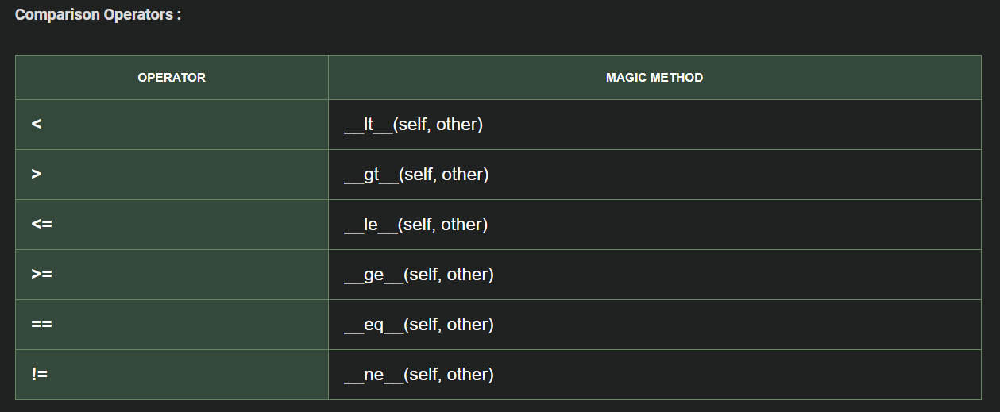
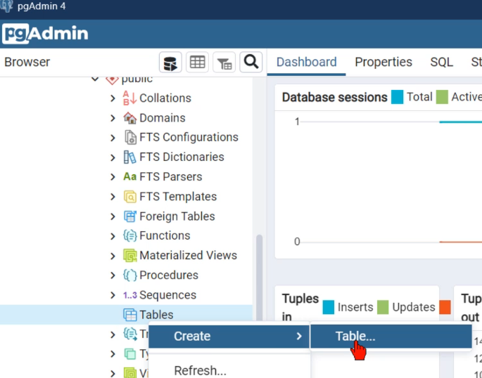

# Python Summary
<!-- TOC -->
* [Basic Concepts and Conventions](python_summary/basic_concepts_conventions.md)
* [Basic Variable Types](python_summary/variables.md)
<!-- TOC -->

# 4. Operators

## 4.1. Arithmetic operators

- `+ - *` `/` *float division* `//` *integer division* `%` *modulo* `**` *power*
*If one of the operators is float result are always float. 
## 4.2. Assignment

- `var_x = value` *Assigns a value to a variable.*
- Multiple assignment: `var_x, var_y, var_z = value_x, value_y, value_z` *Assigns values to multiple variables in a single line.*
- Chained assignment: `var1 = var2 = … = value` *Assigns the same value to multiple variables.*

### 4.2.1. Value exchange without temporary variable
- `x, y = y, x` *Swaps the values of `x` and `y` without using a temporary variable.*

### 4.2.2. Compound assignments
- `variable OPERATOR = value` *Equivalent to `variable = variable OPERATOR value` (e.g., `x += 5` is equivalent to `x = x + 5`).*

---

## 3.3. Conditional and logical operators

- **Return a boolean result**
- **Conditional**: `< > <= >= == !=`
  - *Can use multiple operands: `value_min <= value_x <= value_max`.*
  - *For strings, compares based on ASCII values.*

- **Logical**: `and` `or` `not`
  - *Use `not` to check if a variable is empty. For example: `if not var_x`, returns `True` if `var_x` is empty.*

## 3.4. Operator Precedence in Python
Python follows a specific order of precedence for operators:

1. **Parentheses**
   - `()` have the highest precedence and are used to force the evaluation order.

2. **Exponentiation**
   - `**`

3. **Unary Operators**
   - Unary Plus and Minus: `+`, `-`

4. **Arithmetic Operators**
   - 4.1. Multiplication, Division, Floor Division, Modulus: `*`, `/`, `//`, `%`
   - 4.2. Addition and Subtraction: `+`, `-`

5. **Comparisons**
   - Equality and Relational: `==`, `!=`, `>`, `<`, `>=`, `<=`

6. **Logical Operators**
   - `and`, `or`, `not`
7. **Assignment and Compound Assignments**
   - `=`, `+=`, `-=`, `*=`, `/=`, `%=`, `**=`, `//=`
---

## Unpaking operator  (act 36.367...)
*list 
**dictionary

---

# 4. Sentences

Note: It is not nesseray to convert a varaible to a bool to use the sentencies (conversions are automatic)
## 4.1. Control Sentences

- `if`, `elif`, `else`
- Ternary operator: `result = true_value if condition else false_value`
  - *Use only if the statement fits on one line.*

In Python, a `switch` statement does not exist.

- Use of dictionary

``` python
def opcion_1():
    print("Ejecutando la opción 1...")
    return "Opción 1 completada"

def opcion_2():
    print("Ejecutando la opción 2...")
    return "Opción 2 completada"

def opcion_3():
    print("Ejecutando la opción 3...")
    return "Opción 3 completada"

def switch_demo(argument):
    opciones = {
        1: opcion_1,
        2: opcion_2,
        3: opcion_3,
    }
    funcion = opciones.get(argument, lambda: "Opción no válida")
    return funcion()

# 5. Pruebas
print(switch_demo(1))  # Salida: Ejecutando la opción 1... Opción 1 completada
print(switch_demo(4))  # Salida: Opción no válida
```

- In Python 3.10 or later, you can use *pattern matching*, introduced with the `match` and `case` keywords.

``` python
def switch_demo_v2(argument):
    match argument:
        case 1:
            return "Opción 1 seleccionada"
        case 2:
            return "Opción 2 seleccionada"
        case 3:
            return "Opción 3 seleccionada"
        case _:
            return "Opción no válida"

print(switch_demo_v2(2))  # Salida: Opción 2 seleccionada
```
---

## 5.1. Loop sentences

``` python
while condition:  # while statement
for current_val in sequence:  # for statement
```
For `sequence` we can use the python functions 

* `range(ini, fin+1, increment)`
    * Default `ini = 0` and `increment = 1`
    * If don't use current_val, can be indicated with a `for _ in ...`
* `for counter, item  in enumerate(collection)`


* `break`: out of the loop

* `continue`:  go to next iteration

---

---

# 6. Collections


## 6.1. List `my_list = [item_1, item_2, item3]`
- Items can be of different types
- Ordered and mutable
- Dynamic: can add, modify, and remove elements

### 6.1.1. Operations with lists

- **Consult**  
  - `len(my_list)` - Get the length of the list.  
  - `my_list[index_x]` - Access an item at index `x`.  
  - `my_list[index_ini:index_fin+1]` - Slice the list from `index_ini` to `index_fin`.  
  - `for value in my_list:` - Iterate through the list.  
  - **Find Index**: `my_list.index(value)` - Returns the index of the first occurrence of `value` in the list (raises an error if not found).  

- **Order**:  
  - **Modifies `my_list`**
    - Ascending: `my_list.sort()` - Sorts the list in ascending order (modifies `my_list`).
    - Descending: `my_list.sort(reverse=True)` - Sorts the list in descending order (modifies `my_list`).  
    - Custom Parameter: `my_list.sort(key=custom_parameter)` (e.g., `key=len` to sort by the length of elements).
    - Reverse: `my_list.reverse()` - Reverses the order of elements in the list, without sorting (modifies `my_list`).  
  - Does not modify `my_list`:
    - `sorted(my_list)` (also `reveres` and `key` parameters)
    - `list(reversed(my_list))`
    
- **Add**  
  * At the end of the list: `my_list.append(new_item)`  
  * At a specific index: `my_list.insert(index_x, new_item)` (*other elements shift to the right*)  
  * Extend the list with multiple items: `my_list.extend(iterable)` 
    * *Modifies `my_list` by appending all elements from `iterable`*
  
-**Concatenate**
  * Only for list and tuples can concatenate `list_1 + list_2` 
  * Using unpacking operator `[*list_1, *list_2]`

- **Remove**  
  * By value: `my_list.remove(value)`  
  * By index: `my_list.pop(index_x)` or `del my_list[index_x}`  


- **Copy**:  
* Creating a duplicate of a list to ensure that modifications to the new list do not impact the original.
  - **`.copy()` method**: Creates a shallow copy of the list.  
  - **List slicing**: Uses `[:]` to create a new list that replicates the original.  
  - **`list()` constructor**: Converts the original list into a new list.  
  - **`copy.deepcopy()`**: From the `copy` module, creates a deep copy of nested lists or objects, ensuring full independence from the original.  


## 6.2. Tuple `my_tuple = (item_1, item_2, item_3)`
or `my_tuple = item_1, item_2, item_3`

*only one element with a comma at end `my_tuple = item_1,`*

- Items can be of different types
- Ordered but **immutable** (No can add, modify and drop elements)

Only for list and tuples can concatenate `tuple_1 + tuple_2`

### 6.2.1. Operations with tuples

**Consult and order**  
* `my_tuple[index_x]` - Access an item at index `x`  
* `my_tuple[index_ini:index_fin+1]` - Slice the list from `index_ini` to `index_fin`  


---

## 6.2. Set `my_set = {item_1, item_2, item_3}`

- Items can be of different types
- Not ordered and unique (no duplicated elements)
- Mutable

### 6.2.1. Operations with sets

**Consult**  
- `len(my_set)`  
- `for item in my_set:`  
- Check if value exists: `value_x in my_set`

**Add and remove**  
- `my_set.add(new_item)`  
- `my_set.remove(value)`  

**Set operations**  
- Union: `set_1 | set_2`  
- Intersection: `set_1 & set_2`  
- Difference: `set_1 - set_2`  


---

## 6.3. Dictionary `my_dictionary = {key_1: value_1, key_2: value_2}`

- Items can be of different types (keys are always strings)
- Ordered and mutable
- Keys must be unique (like set items)

### 6.3.1. Operations with dictionaries

* **Consult:** `my_dictionary['key_x']` or `my_dictionary.get(key_x)`  

* **Add or modify:** `my_dictionary['key_x'] = value_x`  

* **Delete:** `my_dictionary.pop('key_x')` or `del my_dictionary['key_x']`  

* **Iteration of elements**  
  * Tuple (key, value): `for key, value in my_dictionary.items():`  
  * Only values: `for value in my_dictionary.values():`  
  * Only keys: `for key in my_dictionary.keys():`  


>## Same reference or copy?
> In Python, when working with collections such as lists, dictionaries, and sets, it's essential to understand the difference between copying a reference and creating an actual copy of the collection. 
> - Failure to do so can lead to unintended errors and bugs.
> - Using the `copy()` method ensures that modifications to the copied collection do not impact the original collection. 
>  - This is particularly important when you need to work independently with a duplicate of the data.


## 6.3. List comprehension `[operation for element in iterable if condition]`

* Create lists from other iterables (filter or apply expressions to each element)  
  * Example: `[x**2 for x in numbers] # do square`
  

## 6.4. Unpacking (tuples, lists, strings)
  * Works with any iterable (tuples, lists, strings)
  * Unpacking is a powerful feature in Python that allows you to assign elements of a sequence (like a tuple) to multiple variables in a single statement.
  * `var_1, var_2, var_3 = (item1, item2, item3)`
  * You can use `*` to capture multiple values into a single variable.
    * Non-starred variables get single items by position
    * Starred variable always gets a list (empty if no items left)
      * First: *start, x, y → start collects all before last 2
      * Middle: x, *mid, y → mid collects between first/last
      * End: x, y, *rest → rest collects all after first 2


---

# 7. Modules

A **module** in Python is a `.py` file containing:
- Functions
- Classes 
- Variables
- Runnable code

## 7.1. Modules characteristics
- Designed for code reusability and organization
- Can be imported into other Python files using `import`
- Creates its own namespace to avoid naming conflicts
- May include documentation (docstrings) at the top
- 

``` python
if __name__ = '__main__': #__name__ varaible that indicate the name of the module that we are ejecuting 
  #Instrucción only if we ejecute the module direcly
```


---

---
# 8. Functions

``` python
def nombre_funcion(param_1, param_2, ...):  # Function name like accion or verb
    # Function body
    return resultado
```
* Can return a single value or a tuple of values (with or without unpacking).

## 8.1. Arguments

* Parameters can have default values: `param = default_value`.
* Variable-length Arguments:
  * `*args`: Receives multiple arguments as a tuple.
  * `**kwargs`: Receives keyword arguments as a dictionary.

Arguments must be specified in this order: `function(req_arg, default_arg="default", *args, **kwargs)`.

``` python
# 7. Function example
def example_function(req_arg, default_arg="default", *args, **kwargs):
    pass

# 8. Calling the function
example_function(
    "value1",                      # req_arg
    "not_default",                 # default_arg
    "extra1", "extra2", "extra3",  # *args
    key1="val1", key2="val2"       # **kwargs
)
```

## 8.2. Use of a global variable inside a function
``` python
variable_name = value

def function(...):
    global variable_name
    variable_name = values...  # or other use of variable_name
```

## 8.3. Recursive functions
* Functions that call themselves.
* Must reach a base case to avoid infinite loops.

``` python
def function_recursiva(...):
    # Base case
    if condition:
        ...
    else:  # Recursive case
        ...
        function_recursiva(...)
```

# 9. Class and Objects

Classes are defined with the first letter capitalized.
```python
class ClassName:
```

To get an object's attributes: `object.__dict__`.

## 9.1. Dynamic Context

### 9.1.1. Constructor and Object Methods
```python
    # Constructor (called when (ClassName()))
    def __init__(self, params...):
    # Attributes
    self.params = params
    ...
    
    # Object method takes the 'self' parameter which refers to the instance from which it is called
    def class_method(self, params...):
        ...
```

In Python, constructor overloading is not allowed; only the last constructor is used.
To work around this, we can assign default values to optional parameters, usually `None`.

### 9.1.2. Attribute and Method Encapsulation
For good practice, getter and setter methods `get_attribute()` and `set_attribute()` are created and used to access and modify parameters outside the class.

```python
    self.public_attribute
    self._protected_attribute
    self.__private_attribute
```
Methods can also be indicated as protected/private using `_`/`__` at the beginning. For example, for data validation functions or methods used only within the class methods.

#### 9.1.2.1. Improved Encapsulation (More Pythonic with Decorators)
To modify protected and private attributes as if they were public, use decorators.

```python
    @property  # Define the getter method in a more Pythonic way
    def attribute(self):
        return self._attribute
    
    @attribute.setter  # Define the setter method in a more Pythonic way
    def attribute(self, value):
        self._attribute = value
```

### 9.1.3. Adding a New Attribute to a Specific Object (Dynamic Attributes)

`setattr(object, 'attribute_name', 'value')`


## 9.2. Static Context

### 9.2.1. Class Attributes and Methods
```python
class ClassName:
    class_attribute  # Defined outside any method in this class
    # Constructor (called when (ClassName()))
    def __init__(self, params...):
```
```python
    ClassName.class_attribute  # Access class attribute
```

Class methods do not take `self` as a parameter.

```python
    @staticmethod  # Decorator indicating a static method
    def static_method():
        ...
```

 **More Pythonic**: Use the `@classmethod` decorator with the `cls` attribute.

```python
    @classmethod
    def class_method(cls):
        ...
```


# 10. Inheritance and Polymorphism

`class Subclass(Superclass):`

* To define an empty class use `pass` (clearer and explicit). `...` (ellipsis) can also be used in more specific contexts to keep a placeholder for future code.

    * Avoid errors and/or serve as a placeholder for future code.
    * Maintain syntactic structure.
    * Debugging purposes.

Override: To override a superclass method in a subclass, define the method with the same name and parameters. The method in the subclass will always be called first.
Polymorphism: Overriding is used to maintain a standard among different subclasses.

To access the superclass behavior, use `super().method_name` inside the subclass.

## 10.1. Polymorphic Function

It can receive different data types (e.g., a parent class or any of its subclasses) as long as they all have the method with the same name and parameters.


## 10.2. Object Class

It is the parent class of all classes in Python, either directly (by default) or indirectly.
We can override the object class methods:
* `__init__()`: Constructor
* `__str__()`: To change how object information is displayed
* `__eq__()`: To modify the way equality is determined


## 10.3. Multiple Inheritance

`class Subclass(Superclass1, Superclass2):`

MRO - Method Resolution Order `Subclass.mro()` *to obtain the order in which method calls are resolved*.

The order of superclasses is important because a method is searched first in the subclass, then in `Superclass1`, then in the classes inherited by `Superclass1`, then in `Superclass2`, then in the classes inherited by `Superclass2`, and finally in the `object` class.

To refer to a specific superclass, do not use `super()` to avoid confusion. Instead, use `SuperclassX.method(self,...)`, where `self` refers to the instance of the subclass.


## 10.4. Abstract Class

To enforce method implementation in subclasses, the parent class must extend `ABC` (Abstract Base Class) and import the `abstractmethod` decorator.
`from abc import ABC, abstractmethod`  

```python
class AbstractClass(ABC):
    @abstractmethod
    def abstract_method(...):
        pass
```

A class that has an abstract method or extends an abstract class without defining the abstract method becomes an abstract class and cannot be instantiated.


## 10.5. Operator Overloading
To modify or implement the behavior of certain operators, override the following methods:




# 11. Exceptions

To prevent the program from terminating abruptly:

```python
import sys

try:
    pass  # Code that may raise an error
except xError as e:
    pass
except Exception as e:
    print(f"An error occurred: {e}")
    #sys.exit() #To ending de program
else:
    ...
    # Only executed if no exception was raised (optional)
finally:
    ...
    # Always executed, whether an exception occurred or not (optional)
# 9. Continuation
```

Normally, exceptions are caught using the generic `Exception` class, but more specific ones can also be used.
A try/except block can have multiple except clauses for different error types (more generic classes should be at the end).
`type(e)` to get the error type (error class).

If we want to end the program `sys.exit()`.

If variables need to be used after the try/except block, they should be defined before the try block.

To define a new exception class:

```python
# 10. Define new error
class NewException(Exception):
    def __init__(self, message):
        self.message = message  # Message to display in the exception

# 11. Raise new error
raise NewException(message)  # Throws the error to be caught later in the except block
```

## 1.4. Input data

- **User data**: `input("Message")` prompts the user for input and always returns a string. Type conversion is necessary afterward if a different data type is needed.
# 12. File Handling

Files can be opened in modes "r" (read), "a" (append), "w" (overwrite), "x" (create), and these can be concatenated with `+`.
Files can also be specified as text files "t" or binary files "b".
```python
try:
    file = open("file.txt", "w", encoding='utf8')  # Open or create files
    file.write("bla bla bla")  # Write to file
except Exception as e:
    print(e)
finally:
    file.close()  # Always close
```
``` python
file.read(num_characters)  # Read all file content if no number is specified
```
``` python
file.readline()  # Read a full line
```
``` python
file.readlines()  # Get a list with each line's content
```
``` python
for line in file:  # Iterate through file
    print(line)
```

To remove a file:
```python
import os
os.remove(path_file)
```
## 12.1. Context Manager 'with'
Automatically closes the resource (e.g., file) using `__enter__` and `__exit__` methods.
```python
with open("file.txt", "w", encoding='utf8') as file:
    file.write("bla bla bla")
```

We can also create our own class for file handling.  
By overriding the `__enter__` and `__exit__` methods, which are already present in the `Object` class (we do not need to explicitly inherit anything).  

```python
class FileHandler:
    def __init__(self, name):
        self.name = name
    
    # Executed when enter to with clause.
    def __enter__(self):
        self.name = open(self.name, 'r', encoding='utf8')
        return self.name
        
    # Executed when exit with clause. These parameters must always be specified
    def __exit__(self, exception_type, exception_value, traceback):  
        print("Closing resource")
        if self.name:
            self.name.close()

with FileHandler("file.txt") as file:
    ...
```

# 13. Logging in Python

You can configure log messages using the <u>[`logging`](https://docs.python.org/3/howto/logging.html)</u> library.

This is used to manage error/debug messages that we send to the console. It is divided into different levels ordered by importance:  


To change the minimum level we want to display on the screen, use `log.basicConfig(level=log.X)`. By default, this level is set to WARNING.

```python
import logging as log
# 12. We change to DEBUG level; since it is the lowest level, messages of all levels will be shown
log.basicConfig(level=log.DEBUG)

if __name__ == '__main__':
    log.debug('Debug level message')
    log.info('Info level message')
    log.warning('Warning level message')
    log.error('Error level message')
    log.critical('Critical level message')
```

To specify the format of the log messages, we can use log.basicConfig(...).
```python
import logging as log

log.basicConfig(level=log.DEBUG,
                format='%(asctime)s: %(levelname)s [%(filename)s:%(lineno)s] %(message)s',  # Message format
                datefmt='%I:%M:%S %p',  # Time format
                handlers=[  # Where we send the messages
                    log.FileHandler('archivo_log.log'),  # Send messages to a file
                    log.StreamHandler()  # Send messages to the console
                ])
```

# 14. .env file

In Python, `.env` files are used to store environment variables in a simple key-value format. These files are helpful for managing sensitive information, such as API keys, database credentials, or configuration settings, without hardcoding them into your application.

The  library `python-dotenv` allows you to easily load the variables from a `.env' file into your environment. 
- You can use the `load_dotenv()` function provided by the library to access these variables, which can then be retrieved using `os.getenv()`.

This approach improves security, facilitates collaboration, and keeps your code clean and adaptable across different environments (development, testing, production).

`.env` file fromat example:
```
POSTGRE_USER=postgres
POSTGRE_HOST=localhost
POSTGRE_PORT=5432
POSTGRE_DB=test_db
```

Use of `python-dotenv` libray to get variable content from `.env` :

```python
import os
from dotenv import load_dotenv  # para importar las varaibles del .env
load_dotenv()
_USERNAME = os.getenv('POSTGRE_USER')
_PASSWORD = os.getenv('POSTGRE_PASSWORD')
_HOST = os.getenv('POSTGRE_HOST')
_DB_PORT = os.getenv('POSTGRE_PORT')
_DATABASE = os.getenv('POSTGRE_DB')
```

# 15. Databases

## 15.1. Basic SQL Queries

Examples of basic queries

```sql
-- Select
SELECT * FROM person
SELECT name FROM person WHERE id_person = 1 
SELECT id_person, name FROM person WHERE id_person IN (1,2)
-- Insert
INSERT INTO person(name, lastname, email) VALUES('Susana','Lara','slara@mail.com')
-- Update
UPDATE person SET name = 'Ivonne' WHERE id_person=3
UPDATE person SET name = 'Ivonne' WHERE id_person IN (3,6)
-- Delete
DELETE FROM person WHERE id_person=3 
DELETE FROM person WHERE id_person IN (2,3)
```

# 16. PostgreSQL in python
## 16.1. pgAdmin4 (graphical interface for PostgreSQL)
To create a new database:


To create a new table:


To view and manually edit the content:


## 16.2. Creating connection and executing statements
We'll use the psycopg2 module to create a database connection.

```python
import psycopg2 as db
# 13. To connect to the database
connection = db.connect(
    user='postgres',
    password='admin',
    host='127.0.0.1',
    port='5432',
    database='test_db'
)
```
If we open a **connection object** with `with`, it doesn't close automatically - we need to use `connection.close()` at the end in a try/finally block. 

In the case of the **cursor**, when the `with` block ends, close are executed automatically.

``` python
try:
    with connection:
        # We need a cursor to execute statements
        with connection.cursor() as cursor:
            statement = 'SELECT * FROM person'
            cursor.execute(statement)
            records = cursor.fetchall() # Get all records
            print(records)
# 14. Catch exceptions
except Exception as e:
    print(f'An error occurred: {e}')
# 15. Always close connection
finally:
    connection.close()
```
Values to pass as **variables** are indicated with `%s` and provided as the second parameter in `cursor.execute(statement, values_tuple)`.

To process multiple records using the `IN` statement, we'll indicate the values in `values_tuple` as a tuple of tuples. For example:
``` python
 sentencia = 'SELECT * FROM persona WHERE id_persona IN %s'
            # llaves_primarias = ((1,2,3),)
            entrada = input('Proporciona los id\'s a buscar (separado por comas): ')
            llaves_primarias = (tuple(entrada.split(',')),)
            cursor.execute(sentencia, llaves_primarias)
            registros = cursor.fetchall()
            # Mostramos registros
            for registro in registros:
                print(registro)
```

To get the  results:
- All records: cursor.fetchall()
- First record: cursor.fetchone()

## 16.3. Transaction management (commit/rollback)
A transaction consists of one or more statements that we want to execute as a block (all or none).

*If we **use** the `with`statement for the cursor, it's handled automatically.*

If we do **NOT** use the with statement for the cursor, we must save changes with `connection.commit()` at the end of our transaction (by default `connection.autocommit = False`). Also, if an error occurs, we must indicate `connection.rollback()` in the except blocks.

# 17. MySQL
Use MySQL databases is similar to postgres.
Connexion to MySQL database 
``` python
import mysql.connector
# 16. Crear una conexion
x_db = mysql.connector.connect(host =...,
                               user = ...,
                               password=...,
                               database=...)

cursor = x_db.cursor() # Crear un cursor
cursor.execute(sentence,values_tuple) # Ejecutar una sentencia
x_db.close() # Cerrar conexion

```

## 17.1. Pool

``` python
from mysql.connector import  pooling, Error

try:
# 17. Crear objecto de pool
  pool = pooling.MySQLConnectionPool(
    pool_name= ...,
    pool_size =...,
    host = ...,
    port = ...,
    database = ...,
    user = ...,
    password = ...)

except Error as e:
  ...

## 17.1. obtener conexion
conn = pool.get_connection()
# 18. obtener cursor
cursor = conn.cursor()
... # Hacer operaciones
conn.close() #liberamos la conexion, no la cerramos del todo!
```