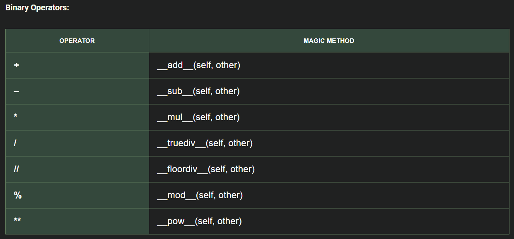

# Python Summary
<!-- TOC -->
  * [Basic Concepts and Conventions](#basic-concepts-and-conventions)
    * [Comments](#comments)
    * [Variables](#variables)
    * [Naming conventions](#naming-conventions)
    * [Print Statement](#print-statement)
  * [Strings](#strings)
    * [Concatenating Strings](#concatenating-strings)
    * [String format](#string-format)
    * [String Methods (do not replace the original string!)](#string-methods-do-not-replace-the-original-string)
  * [Input data](#input-data)
    * [Data type conversion (for MD)](#data-type-conversion-for-md)
  * [Operators](#operators)
    * [Arithmetic operators](#arithmetic-operators)
    * [Assignment](#assignment)
    * [Conditional and logical operators](#conditional-and-logical-operators)
    * [Operator Precedence in Python](#operator-precedence-in-python)
  * [Sentences](#sentences)
    * [Control Sentences](#control-sentences)
    * [Loop sentences](#loop-sentences)
  * [Collections](#collections)
    * [List `my_list = [item_1, item_2, item3]`](#list-my_list--item_1-item_2-item3)
    * [Tuple `my_tuple = (item_1, item_2, item_3)`](#tuple-my_tuple--item_1-item_2-item_3-)
    * [Set `my_set = {item_1, item_2, item_3}`](#set-my_set--item_1-item_2-item_3)
    * [Dictionary `my_dictionary = {key_1: value_1, key_2: value_2}`](#dictionary-my_dictionary--key_1-value_1-key_2-value_2)
    * [List comprehension `[operation for element in iterable if condition]`](#list-comprehension-operation-for-element-in-iterable-if-condition)
  * [Modules](#modules)
    * [Modules characteristics](#modules-characteristics)
  * [Functions](#functions)
    * [Arguments](#arguments)
    * [Use of globla varaible inside a function](#use-of-globla-varaible-inside-a-function)
    * [Recursive functions](#recursive-functions)
<!-- TOC -->


## Basic Concepts and Conventions

### Comments
- Use `#` followed by a space to write comments that explain the code.

### Variables
- **Dynamic typing**: Variables can store any type of data and change their type without explicit casting.
- **Objects**: Variables in Python are references stored in the *stack* and point to data in the *heap*.
- **Mutability**: If the value of a variable changes, a new object is created with the updated data, and the variable points to this new reference.
- **Initialization**: Variables must be declared with an initial value. 
- `ìd(objecto)`: position of memory of the variable object
### Naming conventions

- *No debemos tener fihceros y directorios con el mismo nombre para evitar errores en Python.*
- **Constants**: By convention, constants are named in uppercase (e.g., `CONSTANT_VALUE`) and should not be modified.
- **Snake Case** for common variables and file names:
  - Use the snake_case format: `[a-z][A-Z,a-z,0-9,_]+`.
  - Avoid:
    - Python's reserved keywords.
    - Single-letter variable names (except for exceptions like indices).
    - Names starting with numbers or uppercase letters.
  - Use underscores (`_`) to compose multi-word names (e.g., `file_txt`).
  - Apply prefixes or suffixes to provide context (e.g., `is_valid`, `user_count`).
  - Use of plural names only on collections.

### Print Statement
  - Basic example: `print(x, "y", z)`.
  - Using commas automatically adds spaces between the values in the output.
  - To print a blank line: `print()`.
  - To change final character (default break line) `print(var1, end=' ')`
---

---

## Strings
- **Defining Strings**: Strings can be defined using `'`, `"`, or `'''`. Triple quotes allow you to include line breaks directly within the text.
- **Character Indexing**:
  - Characters are indexed from `0` to `length-1`.
  - Negative indexing allows access from the end of the string: `string[-1]` accesses the last character.
  - **Immutability**: Strings cannot be modified once they are created.


### String concatenation
- **Using the `+` operator**
- Using `split_string.join([list of strings])`
	* Note: if `' '.join(stringX)` is used, it splits characters with a space.

### String format
- f-string: `f' Hola {variable}'`   
	* *Specify float decimals: `f"{float_var1:.2f}"`*
	* *Evaluates expressions inside the string. `f"{num1 + num2}"`*

- format method (more complex and les used): `'Hola {}'.format(variable)`
- other formats `string.center(num,character)` to put bettwen `num` `character`'s the content of string. (for example, to print titles)

#### Special Characters
- The backslash (`\`) is used to include special characters:
  - `\n`: New line.
  - `\t`: Tab.
  - `\\`: Backslash (`\`).
  - `\'`: Single quote within single-quoted strings.


### String Methods (do not replace the original string!)
- Upper and lower case: `str1.upper()`, `str1.lower()`. `str1.title()`...
- Remove beginning and ending spaces: `str1.strip()`
- Length: `len(str1)`
- Slicing (get substring): `str1[start:end]` *The end index character is not included.*
- Find substring: `str1.find(substring)` Returns the index of the first occurrence of the searched substring (-1 if not found).
- Replace method: `new_str = str1.replace(old_substr, new_substr)`
- Split method: Divides the string into a list of elements split by a separator *(default space)*: `str1.split(sep)`
- Repeat the same string: `str1 * n` Repeats the string `str1` `n` times.

---

---

## Input data

- **User data**: `input("Message")` prompts the user for input and always returns a string. Type conversion is necessary afterward if a different data type is needed.
- **Random number**: `randint(a, b)` from the `random` module returns a random integer between `a` and `b` (inclusive).


### Data type conversion (for MD)

- `int(x)` *if x is bool: 0 (False), 1 (True)*
- `float(x)` *Converts x to a floating-point number.*
- `str(x)` *if x is bool: "False" (False), "True" (True)*
- `bool(x)` *`False` value if x is 0, None, or an empty string, list, or collection.*
- Other conversions `hex(x)` *hexadecimal*

With variable and dot: `x.` (*possible type operations*)

---

---
## Operators

### Arithmetic operators

- `+ - *` `/` *float division* `//` *integer division* `%` *modulo* `**` *power*

### Assignment

- `var_x = value` *Assigns a value to a variable.*
- Multiple assignment: `var_x, var_y, var_z = value_x, value_y, value_z` *Assigns values to multiple variables in a single line.*
- Chained assignment: `var1 = var2 = … = value` *Assigns the same value to multiple variables.*

#### Value exchange without temporary variable
- `x, y = y, x` *Swaps the values of `x` and `y` without using a temporary variable.*

#### Compound assignments
- `variable OPERATOR = value` *Equivalent to `variable = variable OPERATOR value` (e.g., `x += 5` is equivalent to `x = x + 5`).*

---

### Conditional and logical operators

- **Return a boolean result**
- **Conditional**: `< > <= >= == !=`
  - *Can use multiple operands: `value_min <= value_x <= value_max`.*
  - *For strings, compares based on ASCII values.*

- **Logical**: `and` `or` `not`
  - *Use `not` to check if a variable is empty. For example: `if not var_x`, returns `True` if `var_x` is empty.*

### Operator Precedence in Python
Python follows a specific order of precedence for operators:

1. **Parentheses**
   - `()` have the highest precedence and are used to force the evaluation order.

2. **Exponentiation**
   - `**`

3. **Unary Operators**
   - Unary Plus and Minus: `+`, `-`

4. **Arithmetic Operators**
   - 4.1. Multiplication, Division, Floor Division, Modulus: `*`, `/`, `//`, `%`
   - 4.2. Addition and Subtraction: `+`, `-`

5. **Comparisons**
   - Equality and Relational: `==`, `!=`, `>`, `<`, `>=`, `<=`

6. **Logical Operators**
   - `and`, `or`, `not`
7. **Assignment and Compound Assignments**
   - `=`, `+=`, `-=`, `*=`, `/=`, `%=`, `**=`, `//=`
---

---

## Sentences
### Control Sentences

- `if`, `elif`, `else`
- Ternary operator: `result = true_value if condition else false_value`
  - *Use only if the statement fits on one line.*

In Python, a `switch` statement does not exist.

- Use of dictionary

``` python
def opcion_1():
    print("Ejecutando la opción 1...")
    return "Opción 1 completada"

def opcion_2():
    print("Ejecutando la opción 2...")
    return "Opción 2 completada"

def opcion_3():
    print("Ejecutando la opción 3...")
    return "Opción 3 completada"

def switch_demo(argument):
    opciones = {
        1: opcion_1,
        2: opcion_2,
        3: opcion_3,
    }
    funcion = opciones.get(argument, lambda: "Opción no válida")
    return funcion()

# Pruebas
print(switch_demo(1))  # Salida: Ejecutando la opción 1... Opción 1 completada
print(switch_demo(4))  # Salida: Opción no válida
```

- In Python 3.10 or later, you can use *pattern matching*, introduced with the `match` and `case` keywords.

``` python
def switch_demo_v2(argument):
    match argument:
        case 1:
            return "Opción 1 seleccionada"
        case 2:
            return "Opción 2 seleccionada"
        case 3:
            return "Opción 3 seleccionada"
        case _:
            return "Opción no válida"

print(switch_demo_v2(2))  # Salida: Opción 2 seleccionada
```
---

### Loop sentences

``` python
while condition:  # while statement
for current_val in sequence:  # for statement
```
For `sequence` we can use the python functions 

* `range(ini, fin+1, increment)`
    * Default `ini = 0` and `increment = 1`
    * If don't use current_val, can be indicated with a `for _ in ...`
* `for counter, item  in enumerate(collection)`


* `break`: out of the loop

* `continue`:  go to next iteration

---

---

## Collections

### List `my_list = [item_1, item_2, item3]`
- Items can be of different types
- Ordered and mutable *Dynamic: can add, modify, and remove elements*

#### Operations with lists

- **Consult and order**  
  * `len(my_list)` - Get the length of the list  
  * `my_list[index_x]` - Access an item at index `x`  
  * `my_list[index_ini:index_fin+1]` - Slice the list from `index_ini` to `index_fin`  
  * `for value in my_list:` - Iterate through the list  
  * **Order:** Ascending `my_list.sort()`, Descending `my_list.sort(reverse=True)`

- **Add**  
  * At the end of the list: `my_list.append(new_item)`  
  * At a specific index: `my_list.insert(index_x, new_item)` (*other elements shift to the right*)  

- **Remove**  
  * By value: `my_list.remove(value)`  
  * By index: `my_list.pop(index_x)` or `del my_list[index_x}`  
  * 
Only lists and tuples can be concatenated using `list_1 + list_2`

---

### Tuple `my_tuple = (item_1, item_2, item_3)` 
or `my_tuple = item_1, item_2, item_3`

*only one element with a comma at end `my_tuple = item_1,`*

- Items can be of different types
- Ordered but **immutable** (No can add, modify and drop elements)

Only lists and tuples can be concatenated using `list_1 + list_2`

#### Operations with tuples

**Consult and order**  
* `my_tuple[index_x]` - Access an item at index `x`  
* `my_tuple[index_ini:index_fin+1]` - Slice the list from `index_ini` to `index_fin`  

* **Unpacking:** `var_1, var_2, var_3 = my_tuple #(item1, item2, item3)`  

---

### Set `my_set = {item_1, item_2, item_3}`

- Items can be of different types
- Not ordered and unique (no duplicated elements)
- Mutable

#### Operations with sets

**Consult**  
- `len(my_set)`  
- `for item in my_set:`  
- Check if value exists: `value_x in my_set`

**Add and remove**  
- `my_set.add(new_item)`  
- `my_set.remove(value)`  

**Set operations**  
- Union: `set_1 | set_2`  
- Intersection: `set_1 & set_2`  
- Difference: `set_1 - set_2`  


---

### Dictionary `my_dictionary = {key_1: value_1, key_2: value_2}`

- Items can be of different types (keys are always strings)
- Ordered and mutable
- Keys must be unique (like set items)

#### Operations with dictionaries

* **Consult:** `my_dictionary['key_x']` or `my_dictionary.get(key_x)`  

* **Add or modify:** `my_dictionary['key_x'] = value_x`  

* **Delete:** `my_dictionary.pop('key_x')` or `del my_dictionary['key_x']`  

* **Iteration of elements**  
  * Tuple (key, value): `for key, value in my_dictionary.items():`  
  * Only values: `for value in my_dictionary.values():`  
  * Only keys: `for key in my_dictionary.keys():`  


---

### List comprehension `[operation for element in iterable if condition]`

* Create lists from other iterables (filter or apply expressions to each element)  
  * Example: `[x**2 for x in numbers] # do square`
  
---

---

## Modules

A **module** in Python is a `.py` file containing:
- Functions
- Classes 
- Variables
- Runnable code

### Modules characteristics
- Designed for code reusability and organization
- Can be imported into other Python files using `import`
- Creates its own namespace to avoid naming conflicts
- May include documentation (docstrings) at the top

``` python
if __name__ = '__main__': #__name__ varaible that indicate the name of the module that we are ejecuting 
  #Instrucción only if we ejecute the module direcly
```


---

---
## Functions

``` python
def nombre_funcion(param_1, param_2, ...):  # Function name like accion or verb
    # Function body
    return resultado
```
* Can return a single value or a tuple of values (with or without unpacking).

### Arguments

* Parameters can have default values: `param = default_value`.
* Variable-length Arguments:
  * `*args`: Receives multiple arguments as a tuple.
  * `**kwargs`: Receives keyword arguments as a dictionary.

Arguments must be specified in this order: `function(req_arg, default_arg="default", *args, **kwargs)`.

``` python
# Function example
def example_function(req_arg, default_arg="default", *args, **kwargs):
    pass

# Calling the function
example_function(
    "value1",                      # req_arg
    "not_default",                 # default_arg
    "extra1", "extra2", "extra3",  # *args
    key1="val1", key2="val2"       # **kwargs
)
```

### Use of a global variable inside a function
``` python
variable_name = value

def function(...):
    global variable_name
    variable_name = values...  # or other use of variable_name
```

### Recursive functions
* Functions that call themselves.
* Must reach a base case to avoid infinite loops.

``` python
def function_recursiva(...):
    # Base case
    if condition:
        ...
    else:  # Recursive case
        ...
        function_recursiva(...)
```

## Class and Objects

Classes are defined with the first letter capitalized.
```python
class ClassName:
```

To get an object's attributes: `object.__dict__`.

### Dynamic Context

#### Constructor and Object Methods
```python
    # Constructor (called when (ClassName()))
    def __init__(self, params...):
    # Attributes
    self.params = params
    ...
    
    # Object method takes the 'self' parameter which refers to the instance from which it is called
    def class_method(self, params...):
        ...
```

In Python, constructor overloading is not allowed; only the last constructor is used.
To work around this, we can assign default values to optional parameters, usually `None`.

#### Attribute and Method Encapsulation
Protected attributes are generally used for classes. This allows more control over attribute reading and writing. Python does not enforce control but follows a naming convention with `_` (protected) and `__` (private) before the attribute name.
For good practice, getter and setter methods `get_attribute()` and `set_attribute()` are created and used to access and modify parameters outside the class.

```python
    self.public_attribute
    self._protected_attribute
    self.__private_attribute
```
Methods can also be indicated as protected/private using `_`/`__` at the beginning. For example, for data validation functions or methods used only within the class methods.

##### Improved Encapsulation (More Pythonic with Decorators)
To modify protected and private attributes as if they were public, use decorators.

```python
    @property  # Define the getter method in a more Pythonic way
    def attribute(self):
        return self._attribute
    
    @attribute.setter  # Define the setter method in a more Pythonic way
    def attribute(self, value):
        self._attribute = value
```

#### Adding a New Attribute to a Specific Object (Dynamic Attributes)

`setattr(object, 'attribute_name', 'value')`


### Static Context

#### Class Attributes and Methods
```python
class ClassName:
    class_attribute  # Defined outside any method in this class
    # Constructor (called when (ClassName()))
    def __init__(self, params...):
```
```python
    ClassName.class_attribute  # Access class attribute
```

Class methods do not take `self` as a parameter.

```python
    @staticmethod  # Decorator indicating a static method
    def static_method():
        ...
```

 **More Pythonic**: Use the `@classmethod` decorator with the `cls` attribute.

```python
    @classmethod
    def class_method(cls):
        ...
```


## Inheritance and Polymorphism

`class Subclass(Superclass):`

* To define an empty class use `pass` (clearer and explicit). `...` (ellipsis) can also be used in more specific contexts to keep a placeholder for future code.

    * Avoid errors and/or serve as a placeholder for future code.
    * Maintain syntactic structure.
    * Debugging purposes.

Override: To override a superclass method in a subclass, define the method with the same name and parameters. The method in the subclass will always be called first.
Polymorphism: Overriding is used to maintain a standard among different subclasses.

To access the superclass behavior, use `super().method_name` inside the subclass.

### Polymorphic Function

It can receive different data types (e.g., a parent class or any of its subclasses) as long as they all have the method with the same name and parameters.


### Object Class

It is the parent class of all classes in Python, either directly (by default) or indirectly.
We can override the object class methods:
* `__init__()`: Constructor
* `__str__()`: To change how object information is displayed
* `__eq__()`: To modify the way equality is determined


### Multiple Inheritance

`class Subclass(Superclass1, Superclass2):`

MRO - Method Resolution Order `Subclass.mro()` *to obtain the order in which method calls are resolved*.

The order of superclasses is important because a method is searched first in the subclass, then in `Superclass1`, then in the classes inherited by `Superclass1`, then in `Superclass2`, then in the classes inherited by `Superclass2`, and finally in the `object` class.

To refer to a specific superclass, do not use `super()` to avoid confusion. Instead, use `SuperclassX.method(self,...)`, where `self` refers to the instance of the subclass.


### Abstract Class

To enforce method implementation in subclasses, the parent class must extend `ABC` (Abstract Base Class) and import the `abstractmethod` decorator.
`from abc import ABC, abstractmethod`  

```python
class AbstractClass(ABC):
    @abstractmethod
    def abstract_method(...):
        pass
```

A class that has an abstract method or extends an abstract class without defining the abstract method becomes an abstract class and cannot be instantiated.


### Operator Overloading
To modify or implement the behavior of certain operators, override the following methods:


## Exceptions

To prevent the program from terminating abruptly:
```python
try:
    pass  # Code that may raise an error
except xError as e:
    pass
except Exception as e:
    print(f"An error occurred: {e}")
else:
    # Only executed if no exception was raised (optional)
finally:
    # Always executed, whether an exception occurred or not (optional)
# Continuation
```

Normally, exceptions are caught using the generic `Exception` class, but more specific ones can also be used.
A try/except block can have multiple except clauses for different error types (more generic classes should be at the end).
`type(e)` to get the error type (error class).

If variables need to be used after the try/except block, they should be defined before the try block.

To define a new exception class:

```python
# Define new error
class NewException(Exception):
    def __init__(self, message):
        self.message = message  # Message to display in the exception

# Raise new error
raise NewException(message)  # Throws the error to be caught later in the except block
```

## File Handling

Files can be opened in modes "r" (read), "a" (append), "w" (overwrite), "x" (create), and these can be concatenated with `+`.
Files can also be specified as text files "t" or binary files "b".
```python
try:
    file = open("file.txt", "w", encoding='utf8')  # Open or create files
    file.write("bla bla bla")  # Write to file
except Exception as e:
    print(e)
finally:
    file.close()  # Always close
```
```python
file.read(num_characters)  # Read all file content if no number is specified
```
```python
file.readline()  # Read a full line
```
```python
file.readlines()  # Get a list with each line's content
```
```python
for line in file:  # Iterate through file
    print(line)
```

### Context Manager 'with'
Automatically closes the resource (e.g., file) using `__enter__` and `__exit__` methods.
```python
with open("file.txt", "w", encoding='utf8') as file:
    file.write("bla bla bla")
```

