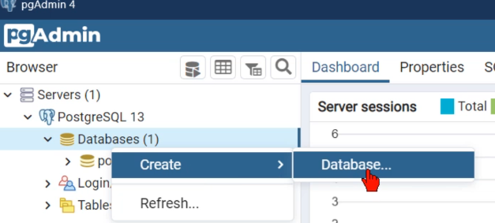
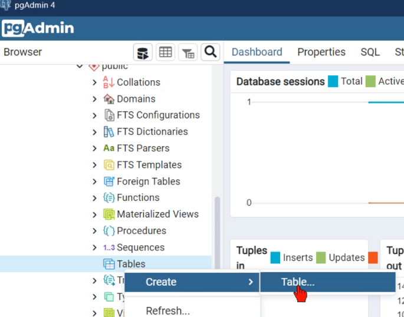
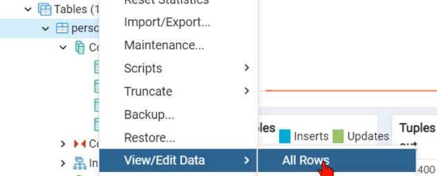

#### [Return to README.md](../README.md)

# Databases


<!-- TOC -->
  * [1. Basic SQL Queries](#1-basic-sql-queries)
  * [2. PostgreSQL in python](#2-postgresql-in-python)
    * [2.1. pgAdmin4 (graphical interface for PostgreSQL)](#21-pgadmin4-graphical-interface-for-postgresql)
    * [2.2. Creating connection and executing statements](#22-creating-connection-and-executing-statements)
    * [2.3. Transaction management (commit/rollback)](#23-transaction-management-commitrollback)
    * [2.4. Connection pool](#24-connection-pool)
  * [3. MySQL](#3-mysql)
    * [3.1. Pool](#31-pool)
<!-- TOC -->


## 1. Basic SQL Queries

Examples of basic queries

```sql
-- Select
SELECT * FROM person
SELECT name FROM person WHERE id_person = 1 
SELECT id_person, name FROM person WHERE id_person IN (1,2)
-- Insert
INSERT INTO person(name, lastname, email) VALUES('Susana','Lara','slara@mail.com')
-- Update
UPDATE person SET name = 'Ivonne' WHERE id_person=3
UPDATE person SET name = 'Ivonne' WHERE id_person IN (3,6)
-- Delete
DELETE FROM person WHERE id_person=3 
DELETE FROM person WHERE id_person IN (2,3)
```

## 2. PostgreSQL in python
### 2.1. pgAdmin4 (graphical interface for PostgreSQL)
To create a new database:


To create a new table:


To view and manually edit the content:



### 2.2. Creating connection and executing statements
We'll use the psycopg2 module to create a database connection.

```python
import psycopg2 as db
# 13. To connect to the database
connection = db.connect(
    user='postgres',
    password='admin',
    host='127.0.0.1',
    port='5432',
    database='test_db'
)
```
If we open a **connection object** with `with`, it doesn't close automatically - we need to use `connection.close()` at the end in a try/finally block. 

In the case of the **cursor**, when the `with` block ends, close are executed automatically.

``` python
try:
    with connection:
        # We need a cursor to execute statements
        with connection.cursor() as cursor:
            statement = 'SELECT * FROM person'
            cursor.execute(statement)
            records = cursor.fetchall() # Get all records
            print(records)
# 14. Catch exceptions
except Exception as e:
    print(f'An error occurred: {e}')
# 15. Always close connection
finally:
    connection.close()
```
Values to pass as **variables** are indicated with `%s` and provided as the second parameter in `cursor.execute(statement, values_tuple)`.

To process multiple records using the `IN` statement, we'll indicate the values in `values_tuple` as a tuple of tuples. For example:
``` python
 sentencia = 'SELECT * FROM persona WHERE id_persona IN %s'
            # llaves_primarias = ((1,2,3),)
            entrada = input('Proporciona los id\'s a buscar (separado por comas): ')
            llaves_primarias = (tuple(entrada.split(',')),)
            cursor.execute(sentencia, llaves_primarias)
            registros = cursor.fetchall()
            # Mostramos registros
            for registro in registros:
                print(registro)
```

To get the  results:
- All records: cursor.fetchall()
- First record: cursor.fetchone()

### 2.3. Transaction management (commit/rollback)
A transaction consists of one or more statements that we want to execute as a block (all or none).

*If we **use** the `with`statement for the cursor, it's handled automatically.*

If we do **NOT** use the with statement for the cursor, we must save changes with `connection.commit()` at the end of our transaction (by default `connection.autocommit = False`). Also, if an error occurs, we must indicate `connection.rollback()` in the except blocks.

### 2.4. Connection pool
A connection pool is a mechanism used to manage and reuse database connections efficiently. 
Instead of creating and closing a new database connection for every query, a connection pool allows a set of connections to be shared.

``` python
from psycopg2 import pool

# Create a connection pool with minimum and maximum connections
connection_pool = pool.SimpleConnectionPool(
    _MIN_CON,  # Minimum number of connections in the pool
    _MAX_CON,  # Maximum number of connections in the pool
    host='...',  # Hostname or IP of the database
    user='...',  # Database username
    password='...',  # Password for the database user
    port='...',  # Port number (e.g., 5432 for PostgreSQL)
    database='...'  # Name of the database
)

# Obtain a connection from the pool
connection = connection_pool.getconn()

# Get a cursor from the connection to execute queries
cursor = connection.cursor()

# Perform database operations
# ...

# Return the connection to the pool after use
connection_pool.putconn(connection)

# When no longer needed, close all connections in the pool
connection_pool.closeall()
```


## 3. MySQL
Use MySQL databases is similar to PostgreSQL.
``` python
import mysql.connector
# 16. Crear una conexion
x_db = mysql.connector.connect(host =...,
                               user = ...,
                               password=...,
                               database=...)

cursor = x_db.cursor() # Crear un cursor
cursor.execute(sentence,values_tuple) # Ejecutar una sentencia
x_db.close() # Cerrar conexion

```

### 3.1. Pool

``` python
from mysql.connector import  pooling, Error

try:
# 17. Crear objecto de pool
  pool = pooling.MySQLConnectionPool(
    pool_name= ...,
    pool_size =...,
    host = ...,
    port = ...,
    database = ...,
    user = ...,
    password = ...)

except Error as e:
  ...

## 17.1. obtener conexion
conn = pool.get_connection()
# 18. obtener cursor
cursor = conn.cursor()
... # Hacer operaciones
conn.close() #liberamos la conexion, no la cerramos del todo!
```