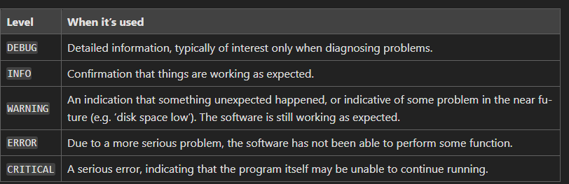

#### [Return to README.md](../README.md)

# Exceptions, Assertions and Logging

<!-- TOC -->

* [1. Exceptions](#1-exceptions)
  * [1.1. Cath exceptions (try/except block)](#11-cath-exceptions-tryexcept-block)
  * [1.2. Define a new exception class](#12-define-a-new-exception-class)
* [Assertions](#assertions)
* [3. Logging in Python](#3-logging-in-python)
  * [2.1. Log levels](#21-log-levels)
  * [2.2. Log format](#22-log-format)

<!-- TOC -->

## 1. Exceptions

### 1.1. Cath exceptions (try/except/else/finally)

Exceptions help prevent your program from terminating abruptly when an error occurs.

Python provides structured handling through `try`, `except`, `else`, and `finally` blocks:

* You can catch multiple exception types with separate `except` clauses.
  * More specific exceptions should come before more general ones (`Exception` should always be last).
* The `else` block is executed only if no exceptions were raised in the try block.
* The `finally` block is always executed, whether or not an exception occurred (useful for cleanup tasks).

```python
try:
    # Code that may raise different types of exceptions
    value = int(input("Enter a number: "))
    result = 10 / value
    print("Result:", result)
except ValueError as e:
    print("Invalid input. Please enter a valid integer.")
    #sys.exit() # Ending de program here
except ZeroDivisionError as e:
    print("Division by zero is not allowed.")
    #sys.exit() # Ending de program here
except Exception as e:  # Generic catch-all
    print(f"An unexpected error occurred: {e} ({type(e).__name__})")
else:   # Only executed if no exception was raised (optional)
    print("Operation completed successfully.")
finally:  # Always executed, whether an exception occurred or not (optional)
    print("Execution finished (cleanup code if needed).")
```

> * If you want to terminate the program explicitly inside an exception, you can call `sys.exit()` (requires `import sys`).
> * If a variable needs to be used after the try block, define it before the block to avoid `UnboundLocalError`.

### 1.2. Define a new exception class

Defining custom exceptions allows you to handle specific error cases more clearly and maintainably in your code.

* Raising a custom exception makes your code more readable and easier to debug, especially in large projects or APIs.
  When creating a new exception class:
* Always consider the exception class hierarchy. Inherit from the most specific built-in exception that fits your use case (e.g., ValueError, TypeError, IOError).
* This ensures your custom exception integrates properly with existing exception handling mechanisms.

To define a new exception class:

* Use `super().__init__()` to ensure the base exception functionality is preserved (e.g., string representation, traceback).

```python
# Define a custom exception class
class InvalidAgeError(ValueError):  # Inherits from a specific built-in exception
    def __init__(self, message):
        self.message = message
        super().__init__(self.message)

# Use the custom exception in a try/except block
try:
    age = -5
    if age < 0:
        raise InvalidAgeError("Age cannot be negative") # raise the error
    print(f"User age is {age}")

except InvalidAgeError as e:
    print(f"Custom exception caught: {e}")

except Exception as e:
    print(f"An unexpected error occurred: {e}")

```

## 2. Assertions

Assertions are a debugging tool used to catch programming errors early in development.

* They test assumptions made by the code, and if an assertion fails, Python raises an `AssertionError`.

> ⚠️ Important: **Assertions** should **not** be used for **handling run-time errors or validating user input**.
>
> * They are intended for internal checks during development and can be disabled with the -O (optimize) flag when running Python.

```python
def process_items(items):
    # This function assumes it always receives a non-empty list
    assert isinstance(items, list), "Expected a list"
    assert len(items) > 0, "List should not be empty"

    # Internally, we also expect all items to be integers
    for item in items:
        assert isinstance(item, int), "All items must be integers"

    return sum(items)

# Correct usage
print(process_items([1, 2, 3]))  # Output: 6

# Developer mistake: passing wrong type
print(process_items("123"))      # AssertionError: Expected a list
```

## 3. Logging in Python

The <u>[`logging`](https://docs.python.org/3/howto/logging.html)</u> module provides a flexible framework for emitting log messages from Python programs.

* It supports severity levels, configurable outputs, and more robust debugging in both development and production environments.

### 2.1. Log levels

Logging levels define the severity of the messages. Logging levels (in increasing order of severity):

* `DEBUG` < `INFO` < `WARNING` < `ERROR` < `CRITICAL`



The default level is `WARNING`, meaning only messages at `WARNING` level or higher are shown unless reconfigured.

* To change the minimum level we want to display on the screen, use `log.basicConfig(level=log.X)`.

  ```python
  import logging as log
  # 12. We change to DEBUG level; since it is the lowest level, messages of all levels will be shown
  log.basicConfig(level=log.DEBUG)

  if __name__ == '__main__':
      log.debug('Debug level message')
      log.info('Info level message')
      log.warning('Warning level message')
      log.error('Error level message')
      log.critical('Critical level message')
  ```

### 2.2. Log format

ou can customize how messages are formatted and where they are sent (console, file, etc.) using `basicConfig()` parameters.


Some format placeholders:

* `%(asctime)s` – Timestamp of the log event
* `%(levelname)s` – Log level name (e.g., INFO, WARNING)
* `%(filename)s` and `%(lineno)d` – File and line number where the log was generated
* `%(message)s` – The actual log message

```python
import logging as log

log.basicConfig(
    level=log.DEBUG,
    format='%(asctime)s | %(levelname)s | %(filename)s:%(lineno)d — %(message)s',
    datefmt='%I:%M:%S %p',
    handlers=[
        log.FileHandler('log_output.log'),  # Save logs to a file
        log.StreamHandler()                 # Also show them in the console
    ]
)

# Example log messages of various severity levels
log.debug('This is a debug message.')  # 12:34:56 PM | DEBUG | test.py:12 | This is a debug message.
log.info('This is an info message.') # 12:34:56 PM | INFO  | test.py:13 | This is a debug message.
log.warning('This is a warning message.') # 12:34:56 PM | WARNING  | test.py:14 | This is a debug message.
log.error('This is an error message.') # 12:34:56 PM | ERROR | test.py:15 | This is a debug message. 
log.critical('This is a critical message.') # 12:34:56 PM | CRITICAL | test.py:16 | This is a debug message.
```
