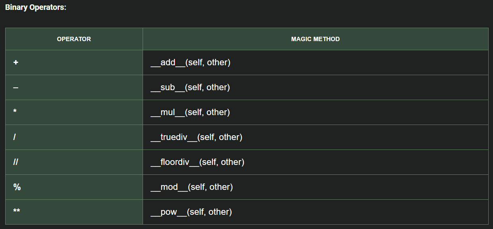
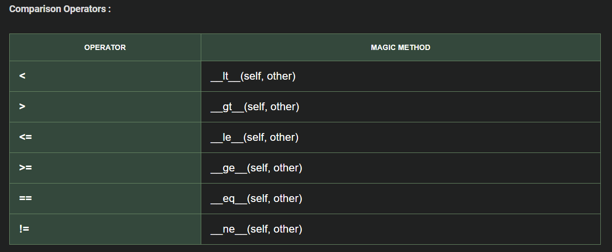
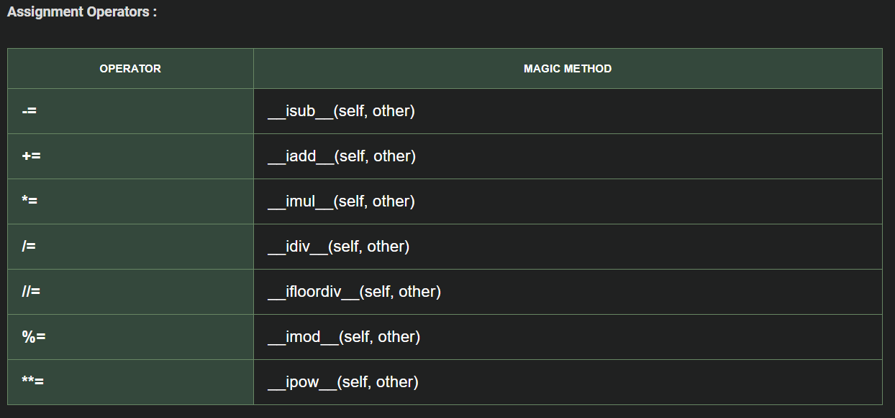
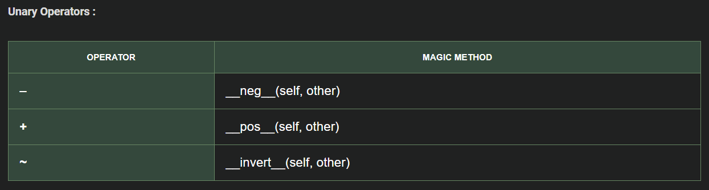

#### [Return to README.md](../README.md)

# Modules, Functions, and Object-Oriented Design

<!-- TOC -->

* [1. Modules](#1-modules)
  * [1.1. Module content](#11-module-content)
  * [1.2. Modules characteristics](#12-modules-characteristics)
  * [1.3. Who run code block only if we execute the module directly](#13-who-run-code-block-only-if-we-execute-the-module-directly)
* [2. Functions](#2-functions)
  * [2.1. Function Parameters and Arguments](#21-function-parameters-and-arguments)
  * [2.2. Functions as First-Class Citizens](#22-functions-as-first-class-citizens)
* [3. Class and Objects](#3-class-and-objects)
  * [3.1. Dynamic Context](#31-dynamic-context)
    * [3.1.1. Constructor and Object Methods](#311-constructor-and-object-methods)
  * [3.2. Static Context](#32-static-context)
    * [3.2.1. Class Attributes and Methods](#321-class-attributes-and-methods)
  * [3.3. Attribute and Method Encapsulation](#33-attribute-and-method-encapsulation)
    * [3.3.1. Improved Encapsulation (Pythonic with decorators)](#331-improved-encapsulation-pythonic-with-decorators)
  * [3.4. Adding a New Attribute to a Specific Object or Class (Dynamic Attributes)](#34-adding-a-new-attribute-to-a-specific-object-or-class-dynamic-attributes)
* [4. Inheritance and Polymorphism](#4-inheritance-and-polymorphism)
  * [4.1. Polymorphic Function](#41-polymorphic-function)
  * [4.2. Object Class](#42-object-class)
  * [4.3. Multiple Inheritance](#43-multiple-inheritance)
  * [4.4. Abstract Class](#44-abstract-class)
  * [4.5. Operator Overloading](#45-operator-overloading)
* [5. Object representation](#5-object-representation-)
  * [5.1. `__repr__`](#51-__repr__)
  * [5.2. `__str__`](#52-__str__)
  * [5.2 `__format__`](#52-__format__)

<!-- TOC -->

## 1. Modules

### 1.1. Module content

A **module** in Python is a `.py` file containing:

- Functions
- Classes
- Variables
- Runnable code

### 1.2. Modules characteristics

- Designed for code reusability and organization
- Content can be imported into other Python files using `import`
- Creates its own namespace to avoid naming conflicts
- May include documentation (docstrings) at the top

### 1.3. Who run code block only if we execute the module directly

In Python, every file is considered a module. When we run a Python file, it gets assigned a special built-in variable called '\_\_name__'. This variable helps Python determine whether a module is being imported or executed directly.
When you run the file directly, Python sets __name__ to '__main__'.

```python
if __name__ = '__main__': 
    # This code block will only run if we execute the module directly
    # It will NOT run if the module is imported elsewhere
```

## 2. Functions

```python
def nombre_funcion(param_1, param_2, ...):  # Function name like accion or verb
    ... # Function body
    return retrun_variable
```

### 2.1. Function Parameters and Arguments

> **Parameters** are the variables listed in the function definition and **arguments** are the actual values passed to the function when it is called.

* Parameters can have default values: `param = default_value`.
* Alos, can include variable-length parameters:
  * `*args`: Receives multiple arguments as a tuple.
  * `**kwargs`: Receives keyword arguments as a dictionary.

Parameters must be specified in this order: `function(req_arg, default_arg="default", *args, **kwargs)`.

```python
# Function example
def example_function(req_arg, default_arg="default", *args, **kwargs):
    pass

# Calling the function
example_function(
    "value1",                      # req_arg
    "not_default",                 # default_arg
    "extra1", "extra2", "extra3",  # *args
    key1="val1", key2="val2"       # **kwargs
)
```

### 2.2. Functions as First-Class Citizens

In Python, functions are treated as first-class citizens. This means:

- Functions can be assigned to variables:

  ```python
  def add(x, y):
      return x + y

  my_add = add
  print(my_add(3, 4))  # Output: 7
  ```
- Functions can be passed as arguments:

  ```python
  def apply_func(func, value):
    return func(value)

  def increment(x):
      return x + 1

  print(apply_func(increment, 5))  # Output: 6
  ```
- Functions can return other functions:

  ```python
   def outer():
     def inner(x):
         return x + 1
     return inner

  add_one = outer()
  print(add_one(5))  # Output: 6
  ```
- When is it necessary to treat functions as first-class citizens?

  - When flexibility is needed to pass functions as arguments or return them from other functions.
  - In functional programming, where functions are passed, returned, and stored dynamically.
  - For creating higher-order functions, decorators, or event handlers.
  - When you need to modify behavior at runtime, like with callbacks or dynamic function generation.

## 3. Class and Objects

Classes are defined with the first letter capitalized.

```python
class ClassName:
```

To get an object's attributes: `object.__dict__`.

### 3.1. Dynamic Context

Dynamic context refers to things that belong to the instances, like instance variables and methods that use `self`.
initialization.

#### 3.1.1. Constructor and Object Methods

```python
    # Constructor (called when (ClassName()))
    def __init__(self, params...):
    # Attributes initialization
    self.params = params
    ...
  
    # Object method takes the 'self' parameter which refers to the instance from which it is called
    def class_method(self, params...):
        ...
```

In Python, constructor overloading is not allowed; only the last constructor is used.
To work around this, we can assign default values to optional parameters, usually `None`.

### 3.2. Static Context

#### 3.2.1. Class Attributes and Methods

```python
class ClassName:
    class_attribute  # Defined outside any method in this class
    # Constructor (called when (ClassName()))
    def __init__(self, params...):
```

```python
    ClassName.class_attribute  # Access class attribute
```

Class methods do not take `self` as a parameter.

```python
    @staticmethod  # Decorator indicating a static method
    def static_method():
        ...
```

**More Pythonic**: Use the `@classmethod` decorator with the `cls` attribute.

```python
    @classmethod
    def class_method(cls):
        ...
```

* *If we want to create a new object from the class inside a class method, we can call the constructor like `cls(constructor_arguments...)`.*

### 3.3. Attribute and Method Encapsulation

> It is a convention but python do not check access automatically.

```python
    self.public_attribute # public atribute (+)
    self._protected_attribute  # should only be accessed within this class or subclasses
    self.__private_attribute #  should only be accessed within this class (avoid collisions with sub and superclasses)
```

Methods can also be indicated as protected/private using `_`/`__` at the beginning. For example, for data validation functions or methods used only within the class methods.

#### 3.3.1. Improved Encapsulation (Pythonic with decorators)

For good practice, getter and setter methods created and used to access and modify parameters outside the class.

To modify protected and private attributes as if they were public, use decorators.

```python
    @property  # Define the getter method in a more Pythonic way
    def attribute(self):
        return self._attribute
  
    @attribute.setter  # Define the setter method in a more Pythonic way
    def attribute(self, value):
        self._attribute = value
```

### 3.4. Adding a New Attribute to a Specific Object or Class (Dynamic Attributes)

In Python, you can dynamically add a new attribute to a single object or a class (without affecting other instances of the same class) in two ways:

- `object.attribute_name = 'value'`

  - Simple and readable.
  - Best when the attribute name is known in advance.
- `setattr(object, 'attribute_name', 'value')`

  - Helpful when the attribute name is dynamic (e.g., stored as a string).
  - Used in metaprogramming or when attribute names are generated at runtime.

## 4. Inheritance and Polymorphism

`class Subclass(Superclass):`

* To define an empty class use `pass` (clearer and explicit). `...` (ellipsis) can also be used in more specific contexts to keep a placeholder for future code.

  * Avoid errors and/or serve as a placeholder for future code.
  * Maintain syntactic structure.
  * Debugging purposes.

Override: To override a superclass method in a subclass, define the method with the same name and parameters. The method in the subclass will always be called first.
Polymorphism: Overriding is used to maintain a standard among different subclasses.

To access the superclass behavior (next MRO class on Multiple Inheritance), use `super().method_name` inside the subclass.

### 4.1. Polymorphic Function

It can receive different data types (e.g., a parent class or any of its subclasses) as long as they all have the method with the same name and parameters.

### 4.2. Object Class

It is the parent class of all classes in Python, either directly (by default) or indirectly.
We can override the object class methods:

* `__init__()`: Constructor
* `__str__()`: To change how object information is displayed
* `__eq__()`: To modify the way equality is determined

### 4.3. Multiple Inheritance and MRO

`class Subclass(Superclass1, Superclass2):`
 
If methods are not overridden in the subclass:
> MRO - Method Resolution Order `Subclass.mro()` *to obtain the order in which method calls are resolved*.
> 
**Search Order Priority Example** on Subclass(Superclass1,Superclass2)

* First in the **Subclass**
* Then in **`Superclass1`**
* Then in **classes inherited by `Superclass1`**
* Then in **`Superclass2`**
* Then in **classes inherited by `Superclass2`**
* Finally in the **`object` class

- *Eliminates duplicates by listing superclasses only after their children in the inheritance order.*

Python **prohibits circular inheritance** (e.g., `A → B → A`) because it creates an infinite loop in the class hierarchy, making method resolution impossible. *Raises TypeError: Cannot create a consistent method resolution order (MRO).*


* If a method exists in multiple superclasses, super().method_x() executes implementations in MRO order.
  * ⚠️The MRO chain **stops immediately** if any parent's  omits `super().method_x()` ⚠️ (important on **`__init__` Behavior in Inheritance**).
  
* To call a **specific superclass method**, avoid `super()` to prevent MRO-based chaining.
  * `SuperclassX.method(self, ...)'  # Bypasses MRO chai


**`isinstance(object, class_name)`** actually checks if any of the classes in the MRO matches the target class. `class_name`can be a tuple of classes names. 

### 4.4. Abstract Class

To enforce method implementation in subclasses, the parent class must extend `ABC` (Abstract Base Class) and import the `abstractmethod` decorator.
`from abc import ABC, abstractmethod`

```python
class AbstractClass(ABC):
    @abstractmethod
    def abstract_method(...):
        pass
```

A class that has an abstract method or extends an abstract class without defining the abstract method becomes an abstract class and cannot be instantiated.

### 4.5. Operator Overloading

To modify or implement the behavior of certain operators, override the following methods:





## 5. Object representation

### 5.1. `__repr__`

The `__repr__p  method (short for representation) is a special method in Python that defines how an object is represented as a string when:

- The repr(obj) function is called or `f({object!r}`
- The object is displayed in Python’s interactive console (when you type the object’s name directly).
- It serves as the official string representation of an object, primarily intended for developers (should be unambiguous and useful for debugging).

Format:

- Follow the pattern: `ClassName(attr1=value1, attr2=value2, ...)`.
- The output should ideally be a valid Python expression that could recreate the object.
- Use `{self.attr!r}` to display strings with quotes (e.g., `'hello'` instead of `hello`).

### 5.2. `__str__`

The `__str__` method defines the "informal" or user-friendly string representation of an object. It's used when:

* The `str(obj)` function is called, `print(obj)` or `f"{obj}"`.
* The object is displayed in user-facing contexts.

1. **Format**:

   * Should be human-readable and concise
   * No strict format requirements (unlike `__repr__`)If `__str__` is not defined, Python falls back to `__repr__

* NOTE: *If `__str__` is not defined, Python falls back to `__repr__`*

### 5.2 `__format__`

The `__format__` method defines how an object should be formatted when:

* Using `format(obj, spec)`
* Using f-strings with format specifiers (`f"{obj:spec}"`)
* Called implicitly by `str.format()`
* NOTE: *If not defined, falls back to `__str__` then `__repr__`*

Use __format__ when you need:

* Multiple display formats for the same object (for different contexts)
* Specialized formatting (e.g., units, coordinate systems)
* Locale-aware representations (currency, dates)

```python
class Price:
    def __format__(self, spec):
        if spec == 'usd': return f"${self.amount:,.2f}"
        elif spec == 'eur': return f"€{self.amount:,.2f}"
        else: return f"{self.amount:.2f} units"

price = Price(1000)
print(f"{price:usd}")  # $1,000.00
print(f"{price:eur}")  # €1,000.00
```
