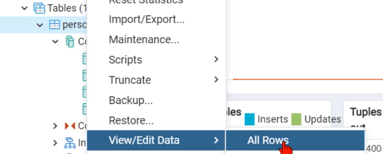

#### [Return to README.md](../README.md)

# Data Serialization and Databases

<!-- TOC -->
  * [1. Data Serialization](#1-data-serialization)
    * [1.1. JSON Handlin](#11-json-handlin)
      * [1.1.1. Store to file and/or add indentation](#111-store-to-file-andor-add-indentation)
    * [1.2. Serializing Non-Serializable Objects](#12-serializing-non-serializable-objects)
    * [1.3. JSON vs. Other Data Formats (e.g., CSV, XML)](#13-json-vs-other-data-formats-eg-csv-xml)
  * [2. Basic SQL Queries](#2-basic-sql-queries)
  * [3. PostgreSQL in python](#3-postgresql-in-python)
    * [3.1. pgAdmin4 (graphical interface for PostgreSQL)](#31-pgadmin4-graphical-interface-for-postgresql)
    * [3.2. Creating connection and executing statements](#32-creating-connection-and-executing-statements)
    * [3.3. Transaction management (commit/rollback)](#33-transaction-management-commitrollback)
    * [3.4. Connection pool](#34-connection-pool)
  * [4. MySQL](#4-mysql)
    * [4.1. Pool](#41-pool)
<!-- TOC -->

## 1. Data Serialization

### 1.1. JSON Handlin
JSON (JavaScript Object Notation) is a lightweight, human-readable format used for storing and exchanging data. 
* It's widely used for communication between servers and web applications or for saving structured data. 

Python provides the `json` module to easily convert between Python objects and JSON format.
* `json.dumps()`: Converts Python objects into a JSON string. 
  * `TypeError` occurs when trying to serialize a non-serializable object.
* `json.loads()`: Parses a JSON string and returns a Python object. 
  * `JSONDecodeError` occurs when the JSON string is malformed.
```python
import json

# Python object to JSON string
data = {'name': 'John', 'age': 30}

try:
    json_str = json.dumps(data)  # Convert Python object to JSON string
    print(json_str)  # {"name": "John", "age": 30}
except TypeError as e:
    print(f"Error during serialization: {e}")

# JSON string to Python object
try:
    data_from_str = json.loads(json_str)  # Convert JSON string to Python object
    print(data_from_str)  # {'name': 'John', 'age': 30}
except json.JSONDecodeError as e:
    print(f"Error during deserialization: {e}")

```

#### 1.1.1. Store to file and/or add indentation
* `json.dump(data, file, indent) ` and `json.load(f)`
  * file:   file where store/read JSON content
  * indent:  add indentation to print or store JSON in a more readable format

```python
import json

data = {'name': 'John', 'age': 30}

# Writing JSON data to a file
with open('data.json', 'w', encoding='utf8') as f:
    json.dump(data, f, indent=4)  # Write with pretty formatting to data.json file

# Reading JSON data from a file
with open('data.json', 'r', encoding='utf8') as f:
    data_from_file = json.load(f)
    print(data_from_file)  # {'name': 'John', 'age': 30}
```


### 1.2. Serializing Non-Serializable Objects

Not all Python objects can be serialized directly into JSON, like `datetime` or custom Python classes need special handling.

* Provide a custom serializer using the `default` parameter of `json.dumps()`:
  * The `default=str` argument converts non-serializable objects to strings during serialization.

  ``` python
  import json
  from datetime import datetime
    
  # Serialize datetime object
  current_time = datetime.now()
  data = {'time': current_time}
  json_str = json.dumps(data, default=str)  # Convert datetime to string
  print(json_str)
    
  # Deserialize back to datetime
  data_from_str = json.loads(json_str)
  data_from_str['time'] = datetime.fromisoformat(data_from_str['time'])
  print(data_from_str)
  ```

* Implement the `__dict__` method:
  * `default` parameter: A function that will be used to convert non-serializable objects into a serializable format (e.g., custom objects).
  ``` python
  import json
  class Person:
      def __init__(self, name, age):
          self.name = name
          self.age = age
    
      def to_dict(self):
          return {'name': self.name, 'age': self.age}
    
  # Serialize a custom object
  person = Person('Alice', 28)
  json_str = json.dumps(person, default=lambda obj: obj.to_dict())
  print(json_str)  # {"name": "Alice", "age": 28}
  ```


### 1.3. JSON vs. Other Data Formats (e.g., CSV, XML)

| Feature         | JSON                                 | CSV                      | XML                            |
| --------------- | ------------------------------------ | ------------------------ | ------------------------------ |
| **Readability** | Human-readable, hierarchical         | Simple, tabular format   | Human-readable, verbose        |
| **Structure**   | Supports nested structures           | Flat, tabular structure  | Can support nested structures  |
| **Use cases**   | APIs, web applications, config files | Simple datasets          | Documents, configuration       |
| **File Size**   | Larger due to flexibility            | Smaller for simple data  | Can be larger due to markup    |
| **Parsing**     | Easy with built-in libraries         | Simple with `csv` module | More complex, uses `xml.etree` |

## 2. Basic SQL Queries

Examples of basic queries

```sql
-- Select
SELECT * FROM person
SELECT name FROM person WHERE id_person = 1 
SELECT id_person, name FROM person WHERE id_person IN (1,2)
-- Insert
INSERT INTO person(name, lastname, email) VALUES('Susana','Lara','slara@mail.com')
-- Update
UPDATE person SET name = 'Ivonne' WHERE id_person=3
UPDATE person SET name = 'Ivonne' WHERE id_person IN (3,6)
-- Delete
DELETE FROM person WHERE id_person=3 
DELETE FROM person WHERE id_person IN (2,3)
```

## 3. PostgreSQL in python
### 3.1. pgAdmin4 (graphical interface for PostgreSQL)
To create a new database:


To create a new table:


To view and manually edit the content:



### 3.2. Creating connection and executing statements
We'll use the psycopg2 module to create a database connection.

```python
import psycopg2 as db
# 13. To connect to the database
connection = db.connect(
    user='postgres',
    password='admin',
    host='127.0.0.1',
    port='5432',
    database='test_db'
)
```
If we open a **connection object** with `with`, it doesn't close automatically - we need to use `connection.close()` at the end in a try/finally block. 

In the case of the **cursor**, when the `with` block ends, close are executed automatically.

``` python
try:
    with connection:
        # We need a cursor to execute statements
        with connection.cursor() as cursor:
            statement = 'SELECT * FROM person'
            cursor.execute(statement)
            records = cursor.fetchall() # Get all records
            print(records)
# 14. Catch exceptions
except Exception as e:
    print(f'An error occurred: {e}')
# 15. Always close connection
finally:
    connection.close()
```
Values to pass as **variables** are indicated with `%s` and provided as the second parameter in `cursor.execute(statement, values_tuple)`.

To process multiple records using the `IN` statement, we'll indicate the values in `values_tuple` as a tuple of tuples. For example:
``` python
 sentencia = 'SELECT * FROM persona WHERE id_persona IN %s'
            # llaves_primarias = ((1,2,3),)
            entrada = input('Proporciona los id\'s a buscar (separado por comas): ')
            llaves_primarias = (tuple(entrada.split(',')),)
            cursor.execute(sentencia, llaves_primarias)
            registros = cursor.fetchall()
            # Mostramos registros
            for registro in registros:
                print(registro)
```

To get the  results:
- All records: cursor.fetchall()
- First record: cursor.fetchone()

### 3.3. Transaction management (commit/rollback)
A transaction consists of one or more statements that we want to execute as a block (all or none).

*If we **use** the `with`statement for the cursor, it's handled automatically.*

If we do **NOT** use the with statement for the cursor, we must save changes with `connection.commit()` at the end of our transaction (by default `connection.autocommit = False`). Also, if an error occurs, we must indicate `connection.rollback()` in the except blocks.

### 3.4. Connection pool
A connection pool is a mechanism used to manage and reuse database connections efficiently. 
Instead of creating and closing a new database connection for every query, a connection pool allows a set of connections to be shared.

``` python
from psycopg2 import pool

# Create a connection pool with minimum and maximum connections
connection_pool = pool.SimpleConnectionPool(
    _MIN_CON,  # Minimum number of connections in the pool
    _MAX_CON,  # Maximum number of connections in the pool
    host='...',  # Hostname or IP of the database
    user='...',  # Database username
    password='...',  # Password for the database user
    port='...',  # Port number (e.g., 5432 for PostgreSQL)
    database='...'  # Name of the database
)

# Obtain a connection from the pool
connection = connection_pool.getconn()

# Get a cursor from the connection to execute queries
cursor = connection.cursor()

# Perform database operations
# ...

# Return the connection to the pool after use
connection_pool.putconn(connection)

# When no longer needed, close all connections in the pool
connection_pool.closeall()
```


## 4. MySQL
Use MySQL databases is similar to PostgreSQL.
``` python
import mysql.connector
# 16. Crear una conexion
x_db = mysql.connector.connect(host =...,
                               user = ...,
                               password=...,
                               database=...)

cursor = x_db.cursor() # Crear un cursor
cursor.execute(sentence,values_tuple) # Ejecutar una sentencia
x_db.close() # Cerrar conexion

```

### 4.1. Pool

``` python
from mysql.connector import  pooling, Error

try:
# 17. Crear objecto de pool
  pool = pooling.MySQLConnectionPool(
    pool_name= ...,
    pool_size =...,
    host = ...,
    port = ...,
    database = ...,
    user = ...,
    password = ...)

except Error as e:
  ...

## 17.1. obtener conexion
conn = pool.get_connection()
# 18. obtener cursor
cursor = conn.cursor()
... # Hacer operaciones
conn.close() #liberamos la conexion, no la cerramos del todo!
```